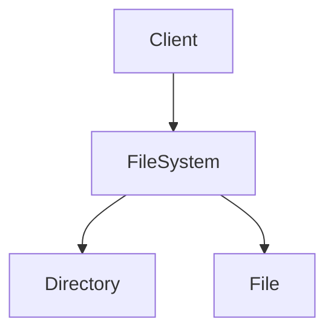
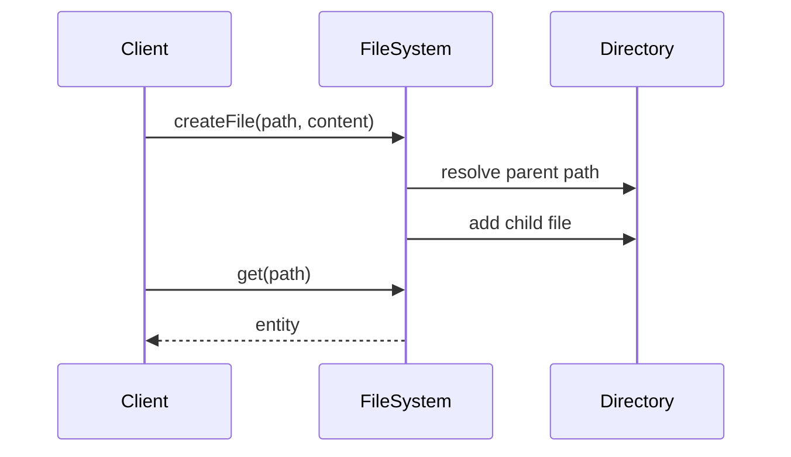

# High-Level Design: File System (In-Memory / Hierarchical)

## 1. Overview

A **hierarchical** namespace: **root** "/", **directories** and **files**; path-based **create**, **read**, **list**, **delete**, **move**. Single-process or service; no persistence required for basic HLD. Models Google Drive / OS file system at conceptual level.

---

## System Design Process
- **Step 1: Clarify Requirements** — See §2 below (paths, operations).
- **Step 2: High-Level Design** — FileSystem, File, Directory (Composite); see §3 below.
- **Step 3: Detailed Design** — Path resolution; API: createFile, get, list, delete, move. See LLD.
- **Step 4: Scale & Optimize** — Optional persistence; sharding by path prefix.

#### High-Level Architecture

**Mermaid:**



#### Flow Diagram — Create file and get path

**Mermaid:**



**API endpoints:** createFile(path, content), get(path), list(path), delete(path), move(src, dest). See LLD.

---

## 2. Requirements

- **Structure:** Tree; root directory; each directory contains files and subdirectories; files have content (string or blob).
- **Paths:** Absolute path like "/home/user/file.txt"; resolve to unique entity (file or directory).
- **Operations:** createFile(path, content), createDirectory(path), get(path), list(path), delete(path), move(srcPath, destPath).
- **Constraints:** No cycles; single parent per entity; unique name per sibling.
- **Optional:** Permissions, symlinks, size limits, persistence.

---

## 3. High-Level Architecture

```
┌─────────────┐     Path ops       ┌──────────────────┐
│  Client     │  (create, get,     │  File System     │
│  (API/CLI)  │   list, delete,    │  Service         │
│             │   move)            │  - Resolve path  │
└─────────────┘───────────────────►│  - CRUD          │
                                    └────────┬─────────┘
                                             │
                    ┌────────────────────────┼────────────────────────┐
                    │                        │                        │
                    ▼                        ▼                        ▼
           ┌────────────────┐      ┌────────────────┐      ┌────────────────┐
           │  Root          │      │  Directory     │      │  File           │
           │  (single       │      │  (children:    │      │  (content,      │
           │   directory)   │      │   files & dirs) │      │   size)         │
           └────────────────┘      └────────────────┘      └────────────────┘
                    │                        │
                    └────── Composite: same interface (path, size); directory has children
```

---

## 4. Core Components

| Component | Responsibility |
|-----------|----------------|
| **FileSystem** | Root directory; createFile(path, content) — resolve parent path, create File, parent.addChild(file); createDirectory(path) — similar; get(path) — resolve path to entity; list(path) — get directory, return children names; delete(path) — get entity, parent.removeChild; move(src, dest) — get src, get dest parent, remove from old parent, add to new (rename if name in dest path). |
| **FileSystemEntity (abstract)** | name, parent (Directory); getPath() (traverse parent to root); getSize() — file: content length, directory: sum of children or 0. |
| **File** | content (string/bytes); getSize() = content.length. |
| **Directory** | children: List<FileSystemEntity>; addChild, removeChild(name), getChild(name), list(); getSize() = sum(children.getSize()) or 0. |

---

## 5. Path Resolution

- Split path by "/"; ignore empty first (root). Traverse from root: for each segment, current = current.getChild(segment); if null and not last → not found; if last and create mode, parent = current, new name = segment.
- Create "/a/b/c": get or create directory "/a", then "/a/b"; create file "c" under "/a/b".

---

## 6. Design Patterns (HLD View)

- **Composite:** FileSystemEntity with File and Directory; Directory holds list of FileSystemEntity; same interface (getPath, getSize); list() only on Directory.
- **Optional:** Proxy for lazy-loading large file content; Visitor for tree walk (size, search).

---

## 7. Trade-offs

| Decision | Choice | Rationale |
|----------|--------|-----------|
| Path storage | Compute from parent chain | No redundant path string; update on move |
| Name uniqueness | Per parent | One "foo" per directory; full path unique |
| Move | Change parent + optional rename | Same entity; parent reference updated |

---

## Interview-Readiness Enhancements

### Capacity & SLO framing
- Define read/write QPS separately and estimate peak vs average traffic.
- Add latency budgets (p95/p99) per critical hop and target availability.
- State durability target and expected data growth/day.

### Critical path clarity
- Document write path (authoritative commit first, async side-effects second).
- Document read path (cache/read model first, fallback to source of truth).
- Identify likely hotspots (hot keys, hot partitions, fanout spikes).

### Failure handling
- Define retry strategy (bounded retries, backoff, jitter).
- Add circuit breakers and bulkheads for unstable dependencies.
- Cover queue failures (DLQ, replay) and datastore failover behavior.

### Security, operations, and cost
- Baseline security: AuthN/AuthZ, encryption in transit/at rest, secrets rotation.
- Observability: golden signals, SLO alerts, tracing, runbooks, canary/rollback.
- DR/cost: explicit RTO/RPO and top cost drivers with optimization levers.

### Trade-off table (mandatory)
- Include at least two realistic alternatives with decision rationale for this system.

