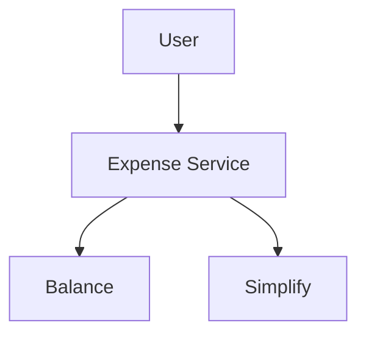
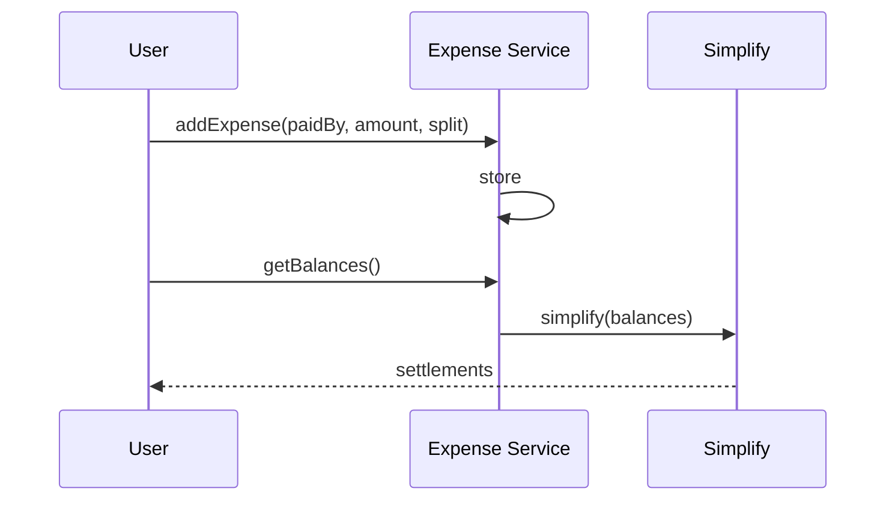

# High-Level Design: Splitwise

## 1. Overview

**Expense sharing** among **users** in **groups**: record who paid how much and how to split (equal, percentage, exact); compute **balances** (who owes whom); **simplify** to **minimum transactions** to settle. Optional groups, history, multi-currency.

---

## System Design Process
- **Step 1: Clarify Requirements** — See §2 below (expenses, balances, simplify).
- **Step 2: High-Level Design** — Expense service, balance calc, simplify; see §3 below.
- **Step 3: Detailed Design** — Expense store; API: addExpense(), getBalances(), simplify(). See LLD.
- **Step 4: Scale & Optimize** — Sharding by group_id; cache balances.

#### High-Level Architecture

**Mermaid:**



#### Flow Diagram — Add expense and simplify

**Mermaid:**



**API endpoints:** POST `/v1/expenses`, GET `/v1/balances`, GET `/v1/simplify`. See LLD.

---

## 2. Requirements

- **Users and groups:** Users can be in groups; expenses are often per group.
- **Expense:** "A paid 100 for all" or "A paid 50 for B and C"; split type: equal, percentage, or exact amount per person.
- **Balances:** Per user (or per group): net amount = total paid by user − total share of user in all expenses; positive = owed to them, negative = they owe.
- **Simplify:** Given balances, find minimal set of **settlements** (A pays B X) so everyone is settled (net 0).
- **Optional:** History, categories, currencies, reminders.

---

## 3. High-Level Architecture

```
┌─────────────┐     Add expense    ┌──────────────────┐
│  Users      │  / Get balances   │  Expense Service  │
│  (App)      │───────────────────►│  - Add expense   │
└─────────────┘                    │  - Compute       │
                                    │    balances     │
                                    └────────┬────────┘
                                             │
                    ┌────────────────────────┼────────────────────────┐
                    │                        │                        │
                    ▼                        ▼                        ▼
           ┌────────────────┐      ┌────────────────┐      ┌────────────────┐
           │  Expense Store  │      │  Balance       │      │  Simplify       │
           │  (who paid,     │      │  Calculator    │      │  (min           │
           │   split)        │      │  (net per user)│      │   transactions) │
           └────────────────┘      └────────────────┘      └────────────────┘
```

---

## 4. Core Components

| Component | Responsibility |
|-----------|----------------|
| **ExpenseService** | addExpense(paidBy, amount, participants, splitType, details); getBalancesInGroup(groupId) — aggregate expenses, compute net per user. |
| **Balance calculation** | For each expense: paidBy gets +amount; each participant gets −share (equal = amount/n, percentage = amount*percent/100, exact = given amount). Net balance per user = sum of (paid − share) across all expenses in scope. |
| **SimplifyService** | simplify(balances: Map<user, amount>) → List<Settlement(from, to, amount). Greedy: max debtor and max creditor; settle min of the two; repeat. Result: at most n−1 transactions; all balances cleared. |
| **Expense Store** | Persist expenses (id, group_id, paid_by, amount, split_type, split_details, created_at). |

---

## 5. Data Flow

1. **Add expense:** Store expense; participants and shares computed; no immediate balance update needed (balances computed on read).
2. **Get balances:** Load all expenses in group (or for user); for each user, sum (amount they paid) − (their share); return map user → net.
3. **Simplify:** Input = balance map (sum = 0). Max heap (debtors), min heap (creditors); repeatedly pop debtor and creditor; amount = min(|debt|, credit); settlement(debtor → creditor, amount); update balances; push back if non-zero; output list of settlements.

---

## 6. Simplify Algorithm (HLD)

- **Goal:** Minimum number of transactions so everyone ends at 0.
- **Greedy:** Always settle between one who owes most and one who is owed most; min of the two amounts; reduces total debt; repeat. Yields at most n−1 transactions (n = users with non-zero balance).
- **Optimality:** This minimizes number of transactions; proof by induction or exchange argument.

---

## 7. Design Patterns (HLD View)

- **Strategy:** SplitStrategy (Equal, Percentage, Exact) for computing shares.
- **Observer:** Notify users when new expense added or settlement suggested.

---

## 8. Trade-offs

| Decision | Choice | Rationale |
|----------|--------|-----------|
| Balance scope | Per group or global | Group = settle within group; global = all expenses |
| Simplify timing | On demand when user views "simplify" | No need to precompute; O(n log n) with heaps |
| Precision | Integer cents or decimal | Avoid float; use cents or fixed decimal |

---

## Interview-Readiness Enhancements

### Capacity & SLO framing
- Define read/write QPS separately and estimate peak vs average traffic.
- Add latency budgets (p95/p99) per critical hop and target availability.
- State durability target and expected data growth/day.

### Critical path clarity
- Document write path (authoritative commit first, async side-effects second).
- Document read path (cache/read model first, fallback to source of truth).
- Identify likely hotspots (hot keys, hot partitions, fanout spikes).

### Failure handling
- Define retry strategy (bounded retries, backoff, jitter).
- Add circuit breakers and bulkheads for unstable dependencies.
- Cover queue failures (DLQ, replay) and datastore failover behavior.

### Security, operations, and cost
- Baseline security: AuthN/AuthZ, encryption in transit/at rest, secrets rotation.
- Observability: golden signals, SLO alerts, tracing, runbooks, canary/rollback.
- DR/cost: explicit RTO/RPO and top cost drivers with optimization levers.

### Trade-off table (mandatory)
- Include at least two realistic alternatives with decision rationale for this system.

