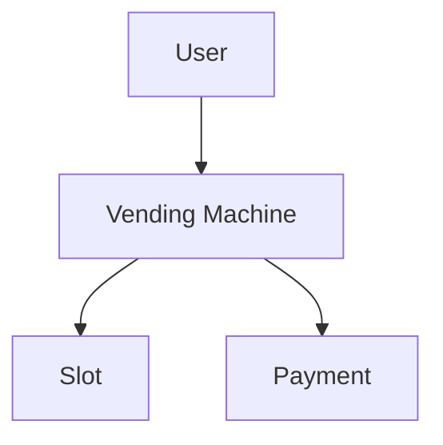
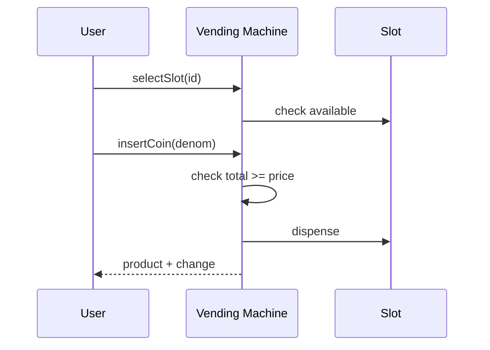

# High-Level Design: Vending Machine

## 1. Overview

A **machine** with **slots** (products + quantity); user **selects** slot, **inserts** money; machine **dispenses** product and **change**. States: Idle → ProductSelected → MoneyInserted → Dispense → Idle. Handles payment validation and inventory.

---

## System Design Process
- **Step 1: Clarify Requirements** — See §2 below (slots, payment, states).
- **Step 2: High-Level Design** — Machine state, slot, payment; see §3 below.
- **Step 3: Detailed Design** — State machine; API: selectSlot(), insertCoin(), dispense(), cancel(). See LLD.
- **Step 4: Scale & Optimize** — Single machine.

#### High-Level Architecture

**Mermaid:**



#### Flow Diagram — Select, insert coins, dispense

**Mermaid:**



**API endpoints:** selectSlot(id), insertCoin(denom), dispense(), cancel(). See LLD.

---

## 2. Requirements

- **Slots:** Grid (e.g. rows × columns); each slot has product (name, price) and quantity; select by slot id (e.g. A1).
- **Payment:** Accept coins (denominations); total inserted ≥ price; dispense product and change (from coin inventory); if change cannot be given, refund and abort.
- **States:** Idle (select product) → ProductSelected (show price, accept coins) → when enough money → Dispense (release item + change) → Idle. Cancel at ProductSelected → refund → Idle.
- **Inventory:** Decrement slot quantity on dispense; optional "sold out" (quantity 0) and admin refill.
- **Optional:** Notes, card; admin collect cash and refill.

---

## 3. High-Level Architecture

```
┌─────────────┐     Select / Coin  ┌──────────────────┐
│  User       │───────────────────►│  Vending Machine  │
│             │                    │  (state machine)  │
└─────────────┘                    └────────┬─────────┘
                                             │
                    ┌────────────────────────┼────────────────────────┐
                    │                        │                        │
                    ▼                        ▼                        ▼
           ┌────────────────┐      ┌────────────────┐      ┌────────────────┐
           │  Slot / Product │      │  Payment       │      │  Dispenser      │
           │  (inventory,   │      │  (coins in,    │      │  (product,      │
           │   price)       │      │   change calc)  │      │   change)       │
           └────────────────┘      └────────────────┘      └────────────────┘
```

---

## 4. Core Components

| Component | Responsibility |
|-----------|----------------|
| **VendingMachine** | Current state (Idle, ProductSelected, MoneyInserted, Dispense); selectedSlot; insertedAmount. selectSlot(slotId) — validate slot and quantity, set state ProductSelected; insertCoin(denom) — add to insertedAmount, if >= price transition to MoneyInserted (or Dispense); dispense() — release product, compute change, release change, clear selection, state Idle. cancel() — refund insertedAmount, Idle. |
| **Slot** | slotId, product, quantity; decrementQuantity(); isAvailable(). |
| **CoinInventory** | Count per denomination; add(denom); getChange(amount) — greedy return list of coins and deduct; canDispenseChange(amount) — check if change possible. |
| **State** | Each state defines valid actions (select, insert, cancel, dispense); transitions on events. |

---

## 5. Data Flow

1. **Idle:** User selects slot A1 → validate A1 exists and quantity > 0 → state = ProductSelected, selectedSlot = A1, display price.
2. **ProductSelected:** User inserts coins → insertedAmount += value; if insertedAmount >= price → state = MoneyInserted (or directly Dispense). User cancel → refund insertedAmount, state = Idle.
3. **Dispense:** If change needed and !coinInventory.canDispenseChange(insertedAmount - price) → refund, show "exact change only", state = Idle. Else: slot.decrementQuantity(); coinInventory.getChange(insertedAmount - price); dispense product and change to user; clear selectedSlot and insertedAmount; state = Idle.

---

## 6. Design Patterns (HLD View)

- **State:** VendingMachineState (IdleState, ProductSelectedState, MoneyInsertedState, DispenseState); each handles select, insert, cancel, dispense and transitions.
- **Strategy:** Optional PaymentStrategy (coins vs card) for different payment methods.

---

## 7. Trade-offs

| Decision | Choice | Rationale |
|----------|--------|-----------|
| Change | Greedy (largest denomination first) | Simple; may fail if coins insufficient → refund |
| Inventory | Per slot quantity; per denomination count | Sufficient for availability and change |
| State | Explicit state class or enum | Clear transitions and validation per state |
