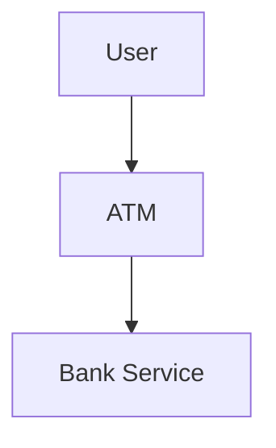
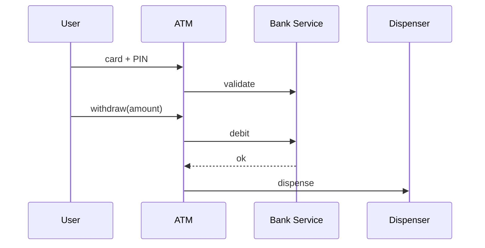

# High-Level Design: ATM System

## 1. Overview

An **ATM** (hardware + software) that lets users **authenticate** (card + PIN), **check balance**, **withdraw** cash, **deposit**, and **transfer** between accounts. Emphasizes **state machine** (session), **validation**, and **integration** with bank backend.

---

## System Design Process
- **Step 1: Clarify Requirements** — See §2 below (auth, balance, withdraw, deposit).
- **Step 2: High-Level Design** — ATM controller, BankService, hardware; see §3 below.
- **Step 3: Detailed Design** — State machine; API: validateCard(), withdraw(), deposit(). See LLD.
- **Step 4: Scale & Optimize** — Bank backend scaling; idempotent debit.

#### High-Level Architecture

**Mermaid:**



#### Flow Diagram — Withdraw

**Mermaid:**



**API endpoints:** validateCardAndPin(), getBalance(), debit(), credit(). See LLD.

---

## 2. Requirements

- **Hardware abstraction:** Card reader, keypad, screen, cash dispenser, deposit slot, printer (receipt).
- **Session:** Insert card → enter PIN → menu (balance, withdraw, deposit, transfer) → perform operation → exit/eject card. Timeout after inactivity.
- **Auth:** Validate card and PIN (via BankService); get list of accounts; user selects account for operations.
- **Withdraw:** Validate amount ≤ available balance and ≤ dispenser capacity; debit account (via Bank); dispense cash; print receipt.
- **Deposit:** Accept cash (simplified: credit amount); update account.
- **Transfer:** Debit one account, credit another; same or different user; validate balance and limits.
- **Safety:** No double debit on retry; PIN never stored plain; limit retries (lock card after N failures).

---

## 3. High-Level Architecture

```
┌─────────────┐     Card / PIN    ┌──────────────────┐
│  User       │  / Operations     │  ATM Controller  │
│             │───────────────────►│  (state machine) │
└─────────────┘                    └────────┬─────────┘
                                             │
                    ┌────────────────────────┼────────────────────────┐
                    │                        │                        │
                    ▼                        ▼                        ▼
           ┌────────────────┐      ┌────────────────┐      ┌────────────────┐
           │  Bank Service   │      │  Hardware      │      │  Session       │
           │  (auth, balance,│      │  (dispenser,   │      │  (current      │
           │   debit, credit)│      │   keypad, etc) │      │   user, account)│
           └────────────────┘      └────────────────┘      └────────────────┘
```

---

## 4. Core Components

| Component | Responsibility |
|-----------|----------------|
| **ATM** | State machine: Idle → CardInserted → PinEntry → Authenticated (menu) → [Withdraw/Deposit/Transfer] → back to menu or Exit → Idle. Current session (card, user, selected account). |
| **BankService** | validateCardAndPin(cardId, pin) → accounts or fail; getBalance(accountId); debit(accountId, amount); credit(accountId, amount); transfer(from, to, amount). |
| **CashDispenser** | dispense(amount); canDispense(amount) — check inventory. |
| **Session** | currentCard, accounts, selectedAccountId; set on auth; clear on exit/timeout. |
| **ReceiptPrinter** | print(transaction summary). |

---

## 5. Data Flow (Withdraw)

1. User in Authenticated state; selects Withdraw; enters amount.
2. Validate: amount > 0, amount <= getBalance(selectedAccountId), amount <= CashDispenser capacity.
3. Call BankService.debit(selectedAccountId, amount); on success: CashDispenser.dispense(amount); ReceiptPrinter.print(...); return success. On failure (e.g. insufficient): show error, stay in menu.
4. Idempotency: Bank may use idempotency key (e.g. requestId) so duplicate request does not double debit.

---

## 6. Design Patterns (HLD View)

- **State:** ATMState (Idle, PinEntry, Authenticated, WithdrawState, etc.); each state handles input (card, PIN, amount, choice) and transitions.
- **Chain of Responsibility:** Validation chain (amount positive → ≤ balance → dispenser capacity) before debit.
- **Facade:** ATM as facade over BankService, CashDispenser, Keypad, Screen, Printer.
- **Adapter:** BankService adapts to real bank API (protocol, format).

---

## 7. Trade-offs

| Decision | Choice | Rationale |
|----------|--------|-----------|
| Auth | Remote (BankService) | No PIN storage at ATM; bank validates |
| Debit first then dispense | Debit then dispense | If dispense fails, bank can credit back (reconciliation) |
| Session timeout | e.g. 2 min | Security; eject card and clear state |
| Retry | Idempotent request key | Network retry does not double debit |

---

## Interview-Readiness Enhancements

### Capacity & SLO framing
- Define read/write QPS separately and estimate peak vs average traffic.
- Add latency budgets (p95/p99) per critical hop and target availability.
- State durability target and expected data growth/day.

### Critical path clarity
- Document write path (authoritative commit first, async side-effects second).
- Document read path (cache/read model first, fallback to source of truth).
- Identify likely hotspots (hot keys, hot partitions, fanout spikes).

### Failure handling
- Define retry strategy (bounded retries, backoff, jitter).
- Add circuit breakers and bulkheads for unstable dependencies.
- Cover queue failures (DLQ, replay) and datastore failover behavior.

### Security, operations, and cost
- Baseline security: AuthN/AuthZ, encryption in transit/at rest, secrets rotation.
- Observability: golden signals, SLO alerts, tracing, runbooks, canary/rollback.
- DR/cost: explicit RTO/RPO and top cost drivers with optimization levers.

### Trade-off table (mandatory)
- Include at least two realistic alternatives with decision rationale for this system.

