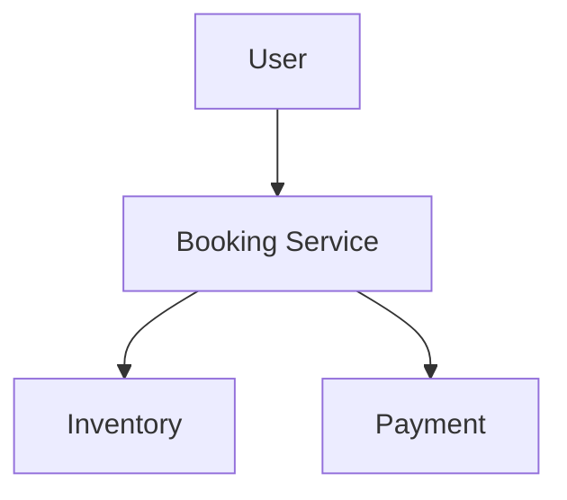
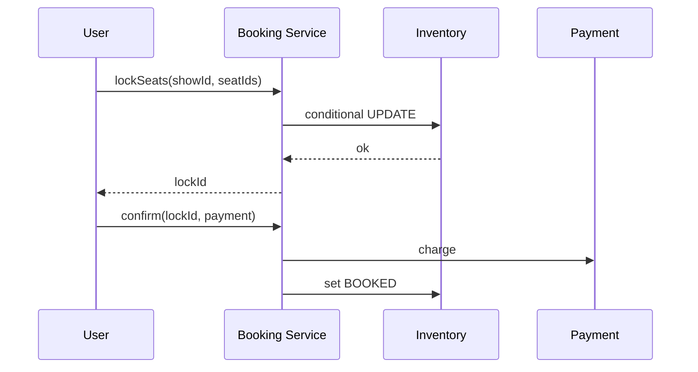

# High-Level Design: BookMyShow & Concurrency

## 1. Overview

**Movie/theatre booking:** **Shows** (movie + screen + time) have **seats**; users **select seats** and **lock** them temporarily (e.g. 5 min) then **pay** to **confirm**; otherwise lock **expires** and seats release. Focus on **concurrency** (no double booking) and **lock-then-confirm** flow.

---

## System Design Process
- **Step 1: Clarify Requirements** — See §2 below (lock seats, pay, confirm).
- **Step 2: High-Level Design** — Booking service, seat inventory, lock; see §3 below.
- **Step 3: Detailed Design** — Conditional UPDATE; API: lockSeats(), confirmBooking(). See LLD.
- **Step 4: Scale & Optimize** — Atomic lock; no double booking.

#### High-Level Architecture

**Mermaid:**



#### Flow Diagram — Lock seats and confirm

**Mermaid:**



**API endpoints:** GET `/v1/shows/:id/seats`, POST `/v1/lock`, POST `/v1/confirm`. See LLD.

---

## 2. Requirements

- **Theatres, screens, shows:** Show = movie + screen + datetime; each show has N seats (numbered, possibly by category).
- **Availability:** Seats can be AVAILABLE, LOCKED (by a user for TTL), or BOOKED.
- **Book flow:** User selects seats → **lock** (reserve for TTL, e.g. 5 min) → user pays → **confirm** (convert lock to booking); on timeout or cancel → **release** lock.
- **Concurrency:** Two users must not get same seat; use **conditional update** (e.g. UPDATE ... WHERE status=AVAILABLE) and **lock id** for confirm.
- **Optional:** Multiple screens, seat categories (gold/silver), waitlist.

---

## 3. High-Level Architecture

```
┌─────────────┐     Lock / Pay     ┌──────────────────┐
│  User       │───────────────────►│  Booking Service │
│  (App)      │                    │  - Lock seats    │
└─────────────┘                    │  - Confirm       │
                                    │  - Release       │
                                    └────────┬─────────┘
                                             │
                    ┌────────────────────────┼────────────────────────┐
                    │                        │                        │
                    ▼                        ▼                        ▼
           ┌────────────────┐      ┌────────────────┐      ┌────────────────┐
           │  Seat Inventory│      │  Lock Store    │      │  Payment       │
           │  (show_id,     │      │  (lock_id,     │      │  (charge,       │
           │   seat_id,     │      │   seats, TTL)  │      │   idempotent)   │
           │   status)      │      │                │      │                 │
           └────────────────┘      └────────────────┘      └────────────────┘
```

---

## 4. Core Components

| Component | Responsibility |
|-----------|----------------|
| **BookingService** | getAvailableSeats(showId); lockSeats(showId, seatIds, userId) — conditional UPDATE seats SET status=LOCKED WHERE show_id AND seat_id IN (...) AND status=AVAILABLE; if affected rows = len(seatIds), create Lock(lockId, ...), return lockId; else return failure. confirmBooking(lockId, paymentId) — validate lock, debit payment, UPDATE seats to BOOKED, delete lock, create Booking. releaseLock(lockId) — set seats AVAILABLE, delete lock. |
| **Seat Inventory** | Per (show_id, seat_id): status (AVAILABLE/LOCKED/BOOKED), locked_by_user_id, lock_expires_at. Conditional update for atomic lock. |
| **Lock Manager** | Store lock (lockId, showId, seatIds[], userId, expiresAt); cron or TTL to release expired locks (set seats AVAILABLE). |
| **Payment** | charge(amount, idempotencyKey); idempotent so confirm retry does not double charge. |

---

## 5. Concurrency (No Double Booking)

- **Lock:** Single atomic UPDATE: UPDATE show_seats SET status='LOCKED', locked_by=?, expires_at=? WHERE show_id=? AND seat_id IN (?) AND status='AVAILABLE'. Check affected row count = number of seats; if less, someone else took at least one seat → fail and retry or return "some seats unavailable".
- **Confirm:** UPDATE seats SET status='BOOKED' WHERE lock_id=? (or WHERE seat_id IN (...) AND locked_by=? AND status='LOCKED'); then delete lock. Only lock holder can confirm.
- **Pessimistic alternative:** SELECT FOR UPDATE on seat rows before update; holds lock until commit.

---

## 6. Data Flow

1. **Lock:** Client sends showId, seatIds[], userId. Server: UPDATE ... WHERE status=AVAILABLE for all seatIds; if success, create Lock, return lockId and expiresAt.
2. **Confirm:** Client sends lockId and payment details. Server: validate lock exists and not expired; call Payment.charge(); on success: UPDATE seats to BOOKED, delete Lock, create Booking, return booking details.
3. **Release (timeout):** Cron every 1 min: find locks where expires_at < now(); for each, UPDATE seats to AVAILABLE, delete Lock.

---

## 7. Design Patterns (HLD View)

- **State:** Seat status (Available, Locked, Booked); transitions on lock, confirm, release.
- **Facade:** BookingService orchestrates inventory, lock, and payment.
- **Idempotency:** Payment and optionally lock request use idempotency key to avoid duplicate charge/dual lock on retry.

---

## 8. Trade-offs

| Decision | Choice | Rationale |
|----------|--------|-----------|
| Lock duration | 5–10 min | Balance: enough to pay; not hold too long |
| Atomicity | Single UPDATE with IN clause | Database guarantees; no race between two lock requests for same seat |
| Release | Cron or async TTL callback | Cron simpler; TTL (e.g. Redis) for immediate release |

---

## Interview-Readiness Enhancements

### Capacity & SLO framing
- Define read/write QPS separately and estimate peak vs average traffic.
- Add latency budgets (p95/p99) per critical hop and target availability.
- State durability target and expected data growth/day.

### Critical path clarity
- Document write path (authoritative commit first, async side-effects second).
- Document read path (cache/read model first, fallback to source of truth).
- Identify likely hotspots (hot keys, hot partitions, fanout spikes).

### Failure handling
- Define retry strategy (bounded retries, backoff, jitter).
- Add circuit breakers and bulkheads for unstable dependencies.
- Cover queue failures (DLQ, replay) and datastore failover behavior.

### Security, operations, and cost
- Baseline security: AuthN/AuthZ, encryption in transit/at rest, secrets rotation.
- Observability: golden signals, SLO alerts, tracing, runbooks, canary/rollback.
- DR/cost: explicit RTO/RPO and top cost drivers with optimization levers.

### Trade-off table (mandatory)
- Include at least two realistic alternatives with decision rationale for this system.

