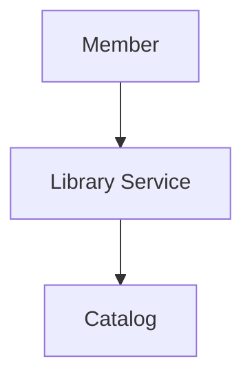
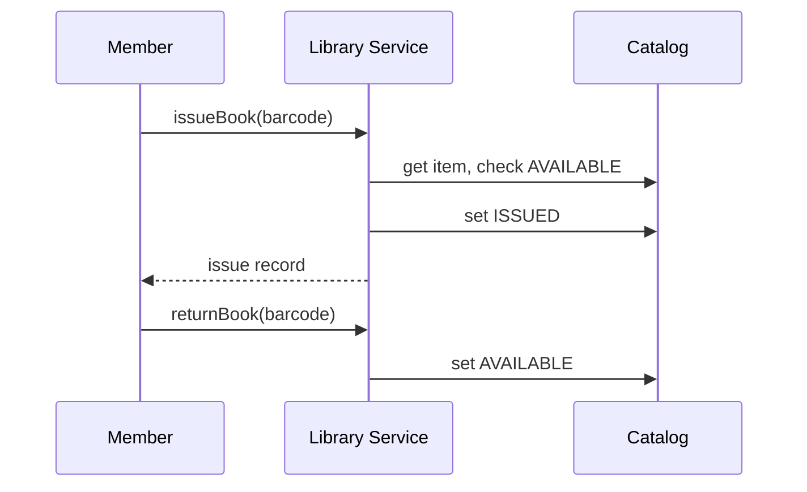

# High-Level Design: Library Management System

## 1. Overview

A **library** has **books** (catalog) and **physical copies** (book items); **members** can **borrow** (issue) and **return** books; **due date** and **fines** for late return; **reservation** when no copy is available. Manages inventory and member lifecycle.

---

## System Design Process
- **Step 1: Clarify Requirements** — See §2 below (issue, return, reserve, fines).
- **Step 2: High-Level Design** — Library service, catalog, fine; see §3 below.
- **Step 3: Detailed Design** — Issue/return records; API: issueBook(), returnBook(), reserve(). See LLD.
- **Step 4: Scale & Optimize** — Sharding by member_id or branch.

#### High-Level Architecture

**Mermaid:**



#### Flow Diagram — Issue and return book

**Mermaid:**



**API endpoints:** POST `/v1/issue`, POST `/v1/return`, POST `/v1/reserve`. See LLD.

---

## 2. Requirements

- **Catalog:** Books (ISBN, title, author); **BookItem** = physical copy (barcode, book_id, status: AVAILABLE/ISSUED/RESERVED).
- **Members:** Register; borrow limit (e.g. 5 books); **issue** = take a book item for N days (e.g. 14); **return** by due date or pay **fine** (per day late).
- **Reservation:** If no copy available, member can reserve; when a copy is returned, first in queue is notified (or auto-assigned); reservation expires if not claimed in M days.
- **Optional:** Rack assignment, search, renew (extend due date), block member on unpaid fine.

---

## 3. High-Level Architecture

```
┌─────────────┐     Issue / Return  ┌──────────────────┐
│  Member    │───────────────────►│  Library Service │
│  (or Staff)│                    │  - Issue          │
└─────────────┘                    │  - Return        │
                                    │  - Reserve       │
                                    └────────┬─────────┘
                                             │
                    ┌────────────────────────┼────────────────────────┐
                    │                        │                        │
                    ▼                        ▼                        ▼
           ┌────────────────┐      ┌────────────────┐      ┌────────────────┐
           │  Catalog        │      │  Issue / Return  │      │  Fines &        │
           │  (books,        │      │  (records,       │      │  Reservations  │
           │   book items)   │      │   due date)      │      │  (queue)       │
           └────────────────┘      └────────────────┘      └────────────────┘
```

---

## 4. Core Components

| Component | Responsibility |
|-----------|----------------|
| **Catalog** | Book (ISBN, title, author); BookItem (barcode, book_id, status). getAvailableCopy(book_id); updateStatus(item_id, status). |
| **LibraryService** | issueBook(memberId, bookItemBarcode) — validate member (under limit, not blocked); get item, check AVAILABLE; create IssueRecord(memberId, itemId, issueDate, dueDate); set item ISSUED; increment member issued count. returnBook(bookItemBarcode) — find IssueRecord, set returnDate; if overdue, compute fine; set item AVAILABLE; decrement member count; if reservations for this book, notify first or assign. reserveBook(memberId, bookId) — add to reservation queue for book_id. |
| **FineService** | calculateFine(issueRecord) — (returnDate - dueDate).days * perDayRate if returnDate > dueDate; record fine; optional block member until paid. |
| **ReservationQueue** | Per book_id: ordered list of (memberId, createdAt). On return: peek first; notify or auto-issue within window; else skip to next. |

---

## 5. Data Flow

1. **Issue:** Member presents item barcode. Validate member; get BookItem by barcode; if status != AVAILABLE return error; create IssueRecord; set item ISSUED; return success.
2. **Return:** Scan barcode; find IssueRecord for this item with return_date null; set return_date = now; fine = calculateFine(record); set item AVAILABLE; if reservation queue for this book not empty, assign item to first reservation (or notify) and set item RESERVED for that member with time limit.
3. **Reserve:** Add (memberId, bookId, createdAt) to reservation table/queue; when copy returned, process queue.

---

## 6. Design Patterns (HLD View)

- **State:** BookItem status (Available, Issued, Reserved); transitions on issue, return, reserve.
- **Observer:** Notify reserved members when book returned (or pull: "your reserved book is available").
- **Strategy:** Fine calculation (flat per day vs graduated).

---

## 7. Data Model (Conceptual)

- **books:** isbn, title, author.
- **book_items:** barcode, book_id, status, rack_id (optional).
- **members:** member_id, name, issued_count, blocked_until (optional).
- **issue_records:** id, member_id, book_item_id, issue_date, due_date, return_date.
- **reservations:** member_id, book_id, created_at; processed (boolean) or remove when fulfilled.
- **fines:** member_id, amount, reason, status (PAID/UNPAID).

---

## 8. Trade-offs

| Decision | Choice | Rationale |
|----------|--------|-----------|
| Due date | Fixed (e.g. 14 days) from issue | Simple; optional renew = new due date |
| Reservation | FIFO queue per book | Fair; optional priority (premium members) |
| Fine block | Block issue until paid | Incentive to pay; optional grace period |
