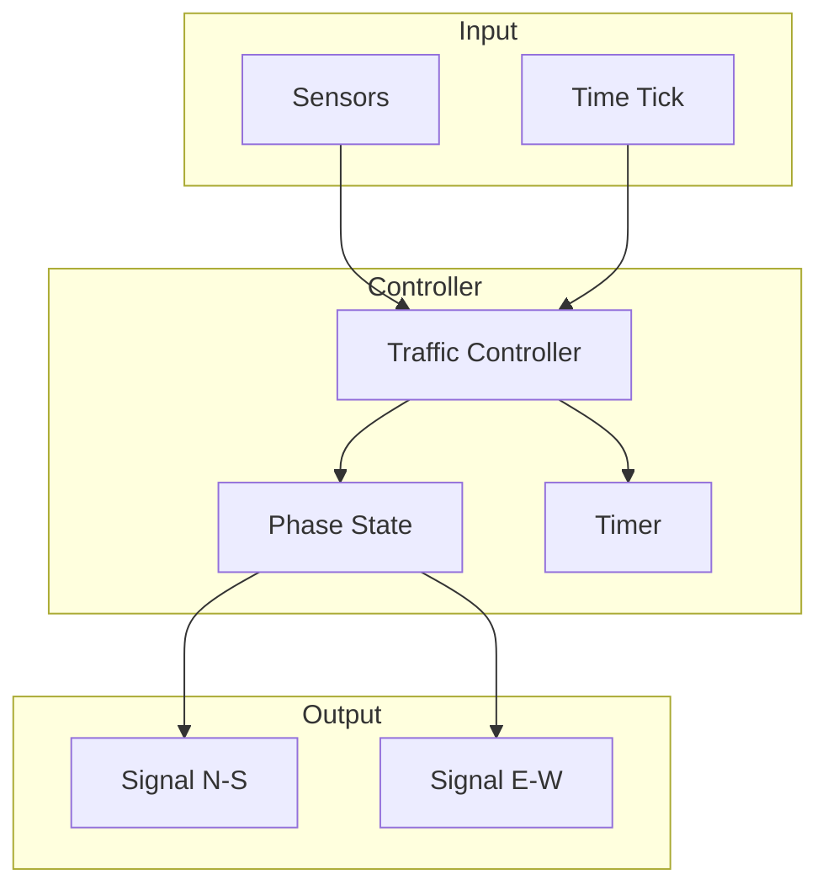
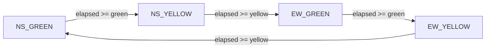

# High-Level Design: Traffic Light System

## 1. Overview

A **traffic light controller** at an **intersection**: multiple **signals** (e.g. N-S, E-W) with **phases** (GREEN, YELLOW, RED); **timing** per phase; **cycle** repeats; optional **sensors** (pedestrian, vehicle) for **adaptive** timing. Single intersection or coordinated.

---

## System Design Process
- **Step 1: Clarify Requirements** — See §2 below (signals, phases, timing).
- **Step 2: High-Level Design** — Controller, phase, timer; see §3 below.
- **Step 3: Detailed Design** — State machine; API: onTick(), getPhase(). See LLD.
- **Step 4: Scale & Optimize** — Multiple intersections; optional green wave.

**API endpoints:** getPhase(), setTiming() (admin). See LLD.

---

#### High-Level Architecture

Component view: controller, phase, signals, timer.

**Mermaid:**



---

#### Flow Diagram — Phase Cycle

Process flow: timer drives phase transitions.

**Mermaid:**



---

## 2. Requirements

- **Signals:** Each direction (or lane group) has a signal: RED, YELLOW, GREEN.
- **Phases:** Only compatible directions get GREEN at once (e.g. N-S green while E-W red); YELLOW as transition before switching.
- **Timing:** Fixed: e.g. N-S green 30s, yellow 3s, then E-W green 30s, yellow 3s; cycle repeats.
- **Safety:** No two conflicting directions green at same time; yellow buffer between green switches.
- **Optional:** Pedestrian button (extend walk / request); vehicle sensors for adaptive green duration; multiple intersections coordinated (green wave).

---

## 3. High-Level Architecture (ASCII)

```
┌─────────────┐     Request /      ┌──────────────────┐
│  Sensors    │     Time tick      │  Traffic         │
│  (optional) │───────────────────►│  Controller      │
└─────────────┘                    │  (state machine) │
                                    └────────┬─────────┘
                                             │
                    ┌────────────────────────┼────────────────────────┐
                    │                        │                        │
                    ▼                        ▼                        ▼
           ┌────────────────┐      ┌────────────────┐      ┌────────────────┐
           │  Phase         │      │  Signal        │      │  Timer         │
           │  (which dirs   │      │  (per direction│      │  (duration,     │
           │   green)       │      │   R/Y/G)       │      │   elapsed)      │
           └────────────────┘      └────────────────┘      └────────────────┘
```

*(Mermaid diagrams for architecture and flow are in the System Design Process section above.)*

---

## 4. Core Components

| Component | Responsibility |
|-----------|----------------|
| **TrafficController** | Current phase (e.g. NS_GREEN, NS_YELLOW, EW_GREEN, EW_YELLOW); phaseDurations; onTick() — increment elapsed; when elapsed >= phase duration, transition to next phase (e.g. GREEN → YELLOW → next GREEN); update all Signal states. |
| **Phase** | Enum or config: which signal group is GREEN; others RED; YELLOW for group that just had GREEN before switch. |
| **Signal** | direction_id, currentState (RED/YELLOW/GREEN); setState(s); display (hardware or simulator). |
| **Timer** | Elapsed time in current phase; reset on phase change. Optional: SensorInput to extend or shorten next green (adaptive). |

---

## 5. Data Flow

1. **Start:** Set initial phase (e.g. NS_GREEN); set N-S signal GREEN, E-W RED; start timer.
2. **Tick (e.g. every 1s):** elapsed++; if elapsed >= greenDuration → set phase NS_YELLOW; N-S signal YELLOW; reset timer. When elapsed >= yellowDuration → set phase EW_GREEN; N-S RED, E-W GREEN; reset timer. Repeat for EW_GREEN → EW_YELLOW → NS_GREEN.
3. **Safety:** Phase definition ensures only one conflicting group is green; yellow always between green switches.

---

## 6. Design Patterns (HLD View)

- **State:** Controller state = current phase; transitions on timer expiry (and optional sensor).
- **Strategy:** FixedTimingStrategy vs AdaptiveTimingStrategy (sensor-based).
- **Observer:** Signals observe phase changes and update display.

---

## 7. Trade-offs

| Decision | Choice | Rationale |
|----------|--------|-----------|
| Timing | Fixed vs adaptive | Fixed simple; adaptive needs sensors and logic |
| Granularity | Per direction or per lane group | Lane groups allow more phases (e.g. left turn) |
| Coordination | Single intersection first | Green wave = multiple controllers with offset |

---

## Interview-Readiness Enhancements

### Capacity & SLO framing
- Define read/write QPS separately and estimate peak vs average traffic.
- Add latency budgets (p95/p99) per critical hop and target availability.
- State durability target and expected data growth/day.

### Critical path clarity
- Document write path (authoritative commit first, async side-effects second).
- Document read path (cache/read model first, fallback to source of truth).
- Identify likely hotspots (hot keys, hot partitions, fanout spikes).

### Failure handling
- Define retry strategy (bounded retries, backoff, jitter).
- Add circuit breakers and bulkheads for unstable dependencies.
- Cover queue failures (DLQ, replay) and datastore failover behavior.

### Security, operations, and cost
- Baseline security: AuthN/AuthZ, encryption in transit/at rest, secrets rotation.
- Observability: golden signals, SLO alerts, tracing, runbooks, canary/rollback.
- DR/cost: explicit RTO/RPO and top cost drivers with optimization levers.

### Trade-off table (mandatory)
- Include at least two realistic alternatives with decision rationale for this system.

