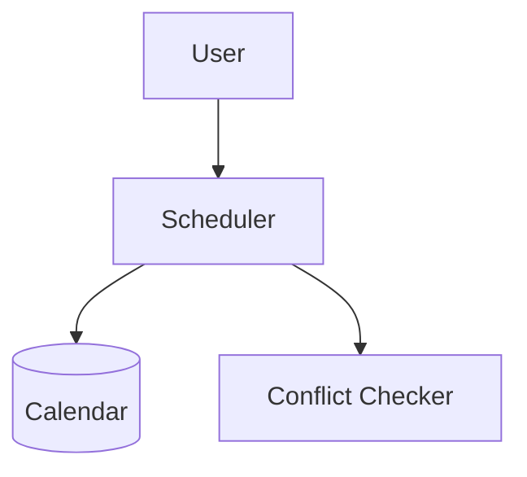
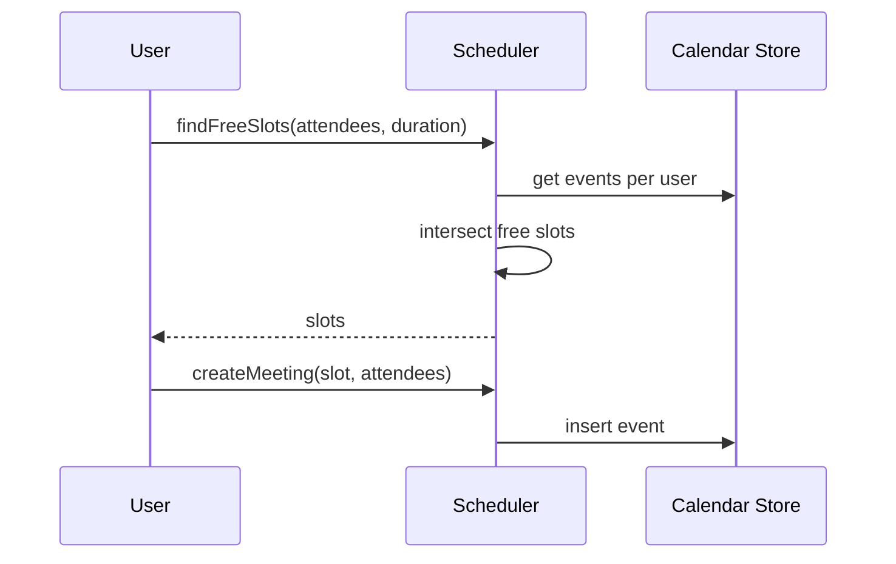

# High-Level Design: Meeting Scheduler

## 1. Overview

**Calendar** and **meeting scheduling:** users have **availability** (or **events**); **create meeting** with **attendees** and **time range**; system finds **free slots** or **validates** proposed slot; **conflicts** and **invites** (accept/decline). Single-user or multi-user (attendees).

---

## System Design Process
- **Step 1: Clarify Requirements** — See §2 below (events, create meeting, free slots).
- **Step 2: High-Level Design** — Scheduler, calendar store, conflict check; see §3 below.
- **Step 3: Detailed Design** — Events table; API: findFreeSlots(), createMeeting(). See LLD.
- **Step 4: Scale & Optimize** — Sharding by user_id; cache free/busy.

#### High-Level Architecture

**Mermaid:**



#### Flow Diagram — Find slots and create meeting

**Mermaid:**



**API endpoints:** GET `/v1/free-slots`, POST `/v1/meetings`, GET `/v1/events`. See LLD.

---

## 2. Requirements

- **Calendar:** Per user: list of events (meetings) with start, end, attendees, status.
- **Create meeting:** Organizer specifies attendees, proposed start/end (or duration); system checks **availability** for all; if free, create event and send invites; if conflict, suggest slots or reject.
- **Availability:** "Free" = no overlapping event for that user in that range; optional working hours and timezone.
- **Invites:** Attendees get invite; accept / decline; optional recurring meetings.
- **Optional:** Rooms/resources; timezone conversion; visibility (busy/free).

---

## 3. High-Level Architecture

```
┌─────────────┐     Create /       ┌──────────────────┐
│  User       │     Find slots     │  Scheduler        │
│  (Organizer)│───────────────────►│  Service         │
└─────────────┘                    │  - Find slots    │
                                    │  - Create meeting│
                                    └────────┬─────────┘
                                             │
                    ┌────────────────────────┼────────────────────────┐
                    │                        │                        │
                    ▼                        ▼                        ▼
           ┌────────────────┐      ┌────────────────┐      ┌────────────────┐
           │  Calendar Store│      │  Conflict       │      │  Notifications │
           │  (events per   │      │  Checker        │      │  (invites,      │
           │   user)        │      │  (overlap)      │      │   updates)      │
           └────────────────┘      └────────────────┘      └────────────────┘
```

---

## 4. Core Components

| Component | Responsibility |
|-----------|----------------|
| **SchedulerService** | findFreeSlots(attendeeIds[], dateRange, duration) — for each attendee load events in range; merge busy intervals; find gaps >= duration; intersect across all attendees; return list of [start, end]. createMeeting(organizerId, attendeeIds[], start, end, title) — check no overlap for any attendee; create Event; send invites. |
| **CalendarStore** | getEvents(userId, start, end); addEvent(event); updateEvent; deleteEvent. Event: id, title, start, end, organizer_id, attendee_ids[], status. |
| **ConflictChecker** | hasConflict(userId, start, end, excludeEventId?) — any event for user overlapping (start, end). |
| **InviteService** | sendInvite(eventId, attendeeIds); record accept/decline; optional update event status. |

---

## 5. Data Flow

1. **Find slots:** Input: [user1, user2], date range, 1 hour. For each user: get events in range → busy intervals; compute free intervals (gaps); intersect free intervals of all users; return slots of length >= 1 hour.
2. **Create meeting:** Input: start, end, attendees. For each attendee: hasConflict(attendee, start, end)? If any conflict → return "slot not available". Else: create Event; send invites; return event id.
3. **Recurring:** Event has recurrence rule (e.g. weekly); create instances or expand when checking conflicts and free slots.

---

## 6. Design Patterns (HLD View)

- **Strategy:** Slot finding (intersect free slots) vs first-available; conflict check reusable.
- **Observer:** Notify attendees on create/update/cancel.
- **Template:** Find slots = get busy → get free → intersect; same for one user or N users.

---

## 7. Trade-offs

| Decision | Choice | Rationale |
|----------|--------|-----------|
| Storage | Events per user (denormalized) or single events table with attendee list | Per-user index for fast "my calendar" and conflict check |
| Slot finding | Intersect free intervals | Correct for "all attendees free"; O(n) merge intervals |
| Timezone | Store UTC; display in user TZ | Avoid DST and comparison errors |

---

## Interview-Readiness Enhancements

### Capacity & SLO framing
- Define read/write QPS separately and estimate peak vs average traffic.
- Add latency budgets (p95/p99) per critical hop and target availability.
- State durability target and expected data growth/day.

### Critical path clarity
- Document write path (authoritative commit first, async side-effects second).
- Document read path (cache/read model first, fallback to source of truth).
- Identify likely hotspots (hot keys, hot partitions, fanout spikes).

### Failure handling
- Define retry strategy (bounded retries, backoff, jitter).
- Add circuit breakers and bulkheads for unstable dependencies.
- Cover queue failures (DLQ, replay) and datastore failover behavior.

### Security, operations, and cost
- Baseline security: AuthN/AuthZ, encryption in transit/at rest, secrets rotation.
- Observability: golden signals, SLO alerts, tracing, runbooks, canary/rollback.
- DR/cost: explicit RTO/RPO and top cost drivers with optimization levers.

### Trade-off table (mandatory)
- Include at least two realistic alternatives with decision rationale for this system.

