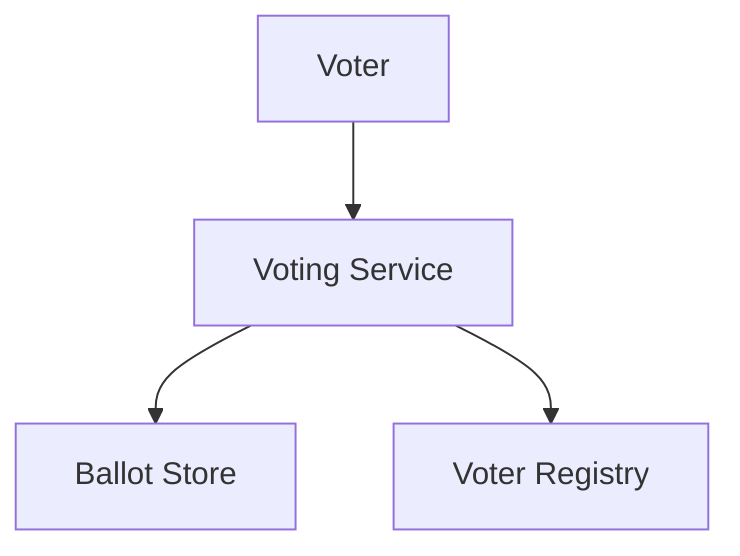
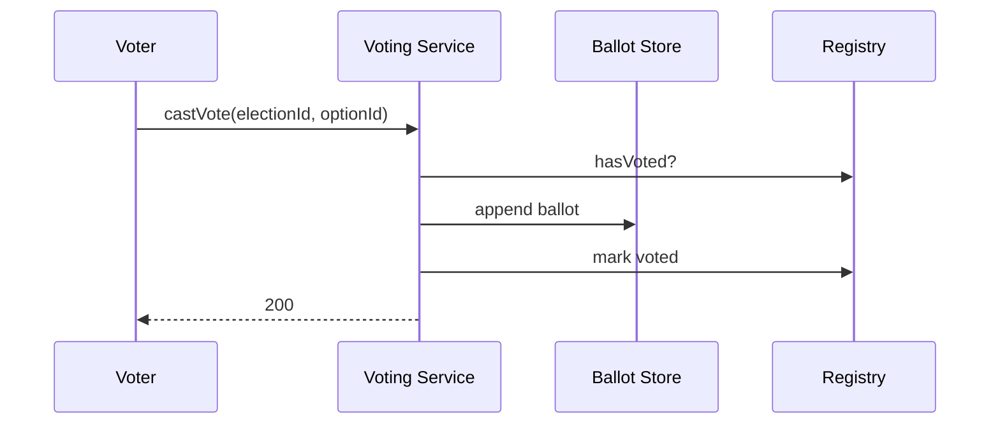

# High-Level Design: Online Voting System

## 1. Overview

**Elections** with **candidates** (or options); **voters** (eligible list); each voter can **cast one vote** per election; **anonymous** and **tamper-proof** tally; **audit** and **result** after poll closes. Focus on **one vote per voter**, **integrity**, and **transparency**.

---

## System Design Process
- **Step 1: Clarify Requirements** — See §2 below (election, vote, tally, one per voter).
- **Step 2: High-Level Design** — Voting service, ballot store, tally; see §3 below.
- **Step 3: Detailed Design** — Ballot append-only; API: castVote(), getResult(). See LLD.
- **Step 4: Scale & Optimize** — Sharding by election_id; immutable ballots.

#### High-Level Architecture

**Mermaid:**



#### Flow Diagram — Cast vote and get result

**Mermaid:**



**API endpoints:** POST `/v1/vote`, GET `/v1/elections/:id/result`. See LLD.

---

## 2. Requirements

- **Election:** id, name, options/candidates, start_time, end_time, status (UPCOMING/ACTIVE/ENDED).
- **Voters:** Eligible list (e.g. by user_id or registration); one vote per voter per election.
- **Vote:** Store choice (candidate_id or option_id) without binding to voter identity in tally (anonymous); prevent double vote (e.g. mark voter as voted without storing link to choice, or use blind signature).
- **Tally:** After end_time: count votes per option; result immutable; optional verification (e.g. homomorphic or commitment scheme for advanced design).
- **Optional:** Authentication (voter must be logged in); CAPTCHA; audit log (who voted when, not what); real-time count (after close).

---

## 3. High-Level Architecture

```
┌─────────────┐     Cast vote      ┌──────────────────┐
│  Voter      │───────────────────►│  Voting Service  │
│  (Auth)     │                    │  - Validate      │
└─────────────┘                    │  - Record vote   │
                                    │  - Tally         │
                                    └────────┬─────────┘
                                             │
                    ┌────────────────────────┼────────────────────────┐
                    │                        │                        │
                    ▼                        ▼                        ▼
           ┌────────────────┐      ┌────────────────┐      ┌────────────────┐
           │  Voter Registry│      │  Ballot Store   │      │  Tally         │
           │  (eligible,    │      │  (election_id, │      │  (counts per   │
           │   voted flag)  │      │   option_id)    │      │   option)       │
           └────────────────┘      └────────────────┘      └────────────────┘
```

---

## 4. Core Components

| Component | Responsibility |
|-----------|----------------|
| **VotingService** | castVote(voterId, electionId, optionId) — validate election ACTIVE, voter eligible, voter not already voted; record vote (election_id, option_id; optionally anonymize from voter_id); mark voter as voted for this election. getResult(electionId) — only if election ENDED; return tally per option. |
| **VoterRegistry** | isEligible(voterId, electionId); markVoted(voterId, electionId); hasVoted(voterId, electionId). |
| **BallotStore** | append-only: (election_id, option_id, timestamp or batch); no update/delete; for tally: COUNT per option_id WHERE election_id. |
| **Tally** | On end: compute counts per option; cache result; optional publish hash for verification. |
| **ElectionManager** | Create election; set start/end; transition status to ACTIVE/ENDED. |

---

## 5. Data Flow

1. **Cast vote:** Voter authenticated; request (electionId, optionId). Check election status = ACTIVE; check voter in eligible list; check !hasVoted(voterId, electionId). Insert ballot (election_id, option_id); markVoted(voterId, electionId). Return success.
2. **Double vote:** hasVoted checked before insert; unique constraint (voter_id, election_id) on "voted" table prevents duplicate.
3. **Tally:** When election ends: SELECT option_id, COUNT(*) FROM ballots WHERE election_id = ? GROUP BY option_id. Publish result; do not allow change.

---

## 6. Design Patterns (HLD View)

- **State:** Election status (Upcoming, Active, Ended); vote allowed only in Active.
- **Immutability:** Ballots append-only; no delete/update of past votes.
- **Idempotency:** Same (voter, election) always returns "already voted" on retry.

---

## 7. Trade-offs

| Decision | Choice | Rationale |
|----------|--------|-----------|
| Anonymity | Store vote without voter_id in ballot; separate "voted" list | Tally cannot link vote to voter; double-vote prevented by voted list |
| Integrity | Append-only ballots; checksums or Merkle tree for audit | Tamper-evident; audit can verify count |
| Result timing | Only after end_time | Avoid early disclosure affecting later votes |
