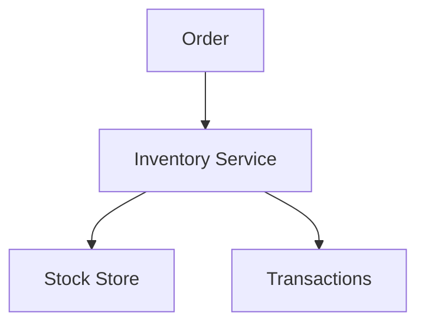
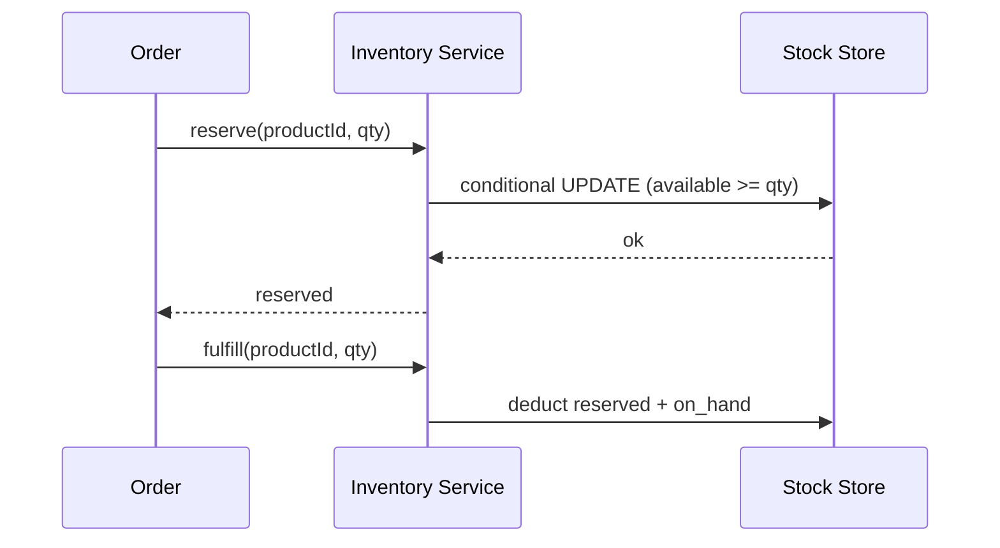

# High-Level Design: Inventory Management System

## 1. Overview

**Products** (SKU) with **quantity** in **warehouse(s)**; **incoming** (purchase, return) and **outgoing** (order, transfer) **transactions**; **reservations** for orders; **reorder** when stock below threshold. Tracks stock levels and movement.

---

## System Design Process
- **Step 1: Clarify Requirements** — See §2 below (reserve, fulfill, receive).
- **Step 2: High-Level Design** — Inventory service, stock store, transactions; see §3 below.
- **Step 3: Detailed Design** — Atomic reserve; API: reserve(), fulfill(), receive(). See LLD.
- **Step 4: Scale & Optimize** — Sharding by product_id; conditional UPDATE.

#### High-Level Architecture

**Mermaid:**



#### Flow Diagram — Reserve and fulfill

**Mermaid:**



**API endpoints:** POST `/v1/reserve`, POST `/v1/fulfill`, POST `/v1/receive`. See LLD.

---

## 2. Requirements

- **Products:** SKU, name; **inventory** per product (and optionally per warehouse): quantity on hand, reserved quantity.
- **Transactions:** In (purchase, return from customer); Out (sale, transfer out); each has type, product_id, quantity, reference (order_id, PO_id), timestamp.
- **Reservation:** When order placed, reserve quantity (available -= reserve, reserved += reserve); on shipment, deduct from reserved and record out; on cancel, release reservation.
- **Availability:** available = on_hand − reserved; cannot sell or reserve more than available.
- **Reorder:** When on_hand (or available) < reorder_level, trigger reorder (alert or create PO).
- **Optional:** Multi-warehouse; batch/lot; FIFO expiry.

---

## 3. High-Level Architecture

```
┌─────────────┐     Order /        ┌──────────────────┐
│  Orders     │     Receive        │  Inventory       │
│  Warehouse  │───────────────────►│  Service         │
└─────────────┘                    │  - Reserve       │
                                    │  - Fulfill       │
                                    │  - Receive       │
                                    └────────┬─────────┘
                                             │
                    ┌────────────────────────┼────────────────────────┐
                    │                        │                        │
                    ▼                        ▼                        ▼
           ┌────────────────┐      ┌────────────────┐      ┌────────────────┐
           │  Stock Store    │      │  Transactions  │      │  Reorder       │
           │  (on_hand,     │      │  (in/out,      │      │  (threshold,   │
           │   reserved)    │      │   audit)       │      │   alert)        │
           └────────────────┘      └────────────────┘      └────────────────┘
```

---

## 4. Core Components

| Component | Responsibility |
|-----------|----------------|
| **InventoryService** | reserve(productId, quantity, orderId) — check available >= quantity; UPDATE stock SET reserved = reserved + quantity WHERE product_id AND (on_hand - reserved) >= quantity; if affected = 0 fail; else record reservation. fulfill(productId, quantity, orderId) — deduct from reserved and on_hand; insert OUT transaction. receive(productId, quantity, ref) — UPDATE on_hand += quantity; insert IN transaction. releaseReservation(orderId) — return reserved to available (reserved -= qty). |
| **StockStore** | Per product (and warehouse): on_hand, reserved; available = on_hand - reserved. Atomic UPDATE for reserve/fulfill to avoid oversell. |
| **TransactionLog** | Append-only: type (IN/OUT), product_id, quantity, ref_id, created_at; for audit and history. |
| **ReorderMonitor** | When on_hand (or available) < reorder_level for product, trigger alert or create purchase order. |

---

## 5. Data Flow (Reserve & Fulfill)

1. **Reserve:** Order created for product P, qty 5. Check available(P) >= 5; UPDATE ... SET reserved = reserved + 5 WHERE product_id = P AND (on_hand - reserved) >= 5; if row updated, record (order_id, product_id, 5); else "insufficient stock".
2. **Fulfill (ship):** UPDATE on_hand = on_hand - 5, reserved = reserved - 5 WHERE product_id = P; insert OUT transaction; clear reservation for this order.
3. **Cancel:** reserved = reserved - 5 for that order's reservation; no change to on_hand.

---

## 6. Design Patterns (HLD View)

- **State:** Inventory line state (available, reserved, on_order); transitions on reserve, fulfill, receive.
- **Observer:** ReorderMonitor observes low stock; optional event on threshold breach.
- **Atomicity:** Single UPDATE with condition (on_hand - reserved >= qty) for reserve to prevent race.

---

## 7. Trade-offs

| Decision | Choice | Rationale |
|----------|--------|-----------|
| Oversell prevention | Conditional UPDATE (available >= qty) | Database guarantees; no double allocation |
| Reservation TTL | Optional expiry and release | Avoid stuck reserved stock; release on cancel |
| Multi-warehouse | Stock per (product, warehouse) | Allocate from specific DC; transfer between warehouses |
