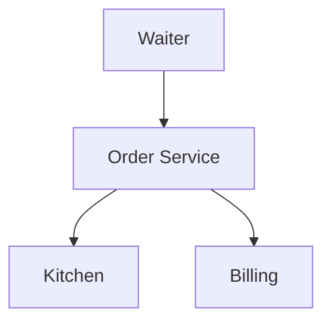
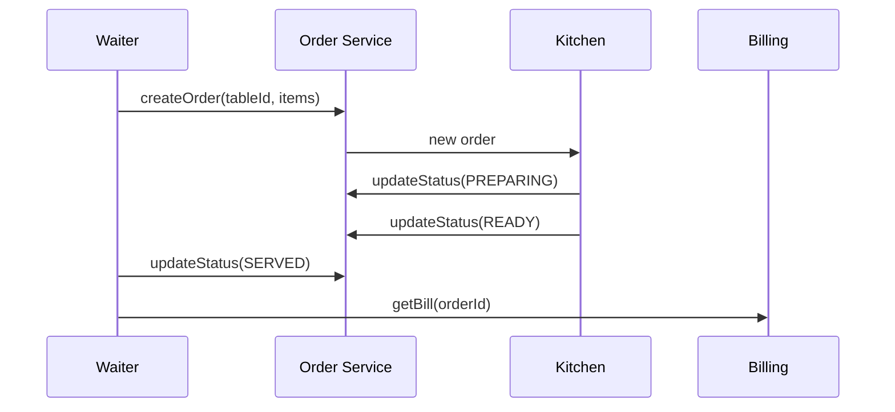

# High-Level Design: Restaurant Management System

## 1. Overview

**Restaurant** flow: **menu** (items, price); **orders** (table/takeaway, items, status); **kitchen** receives order and updates **preparation status**; **billing** and **payment**. Covers order lifecycle and coordination between front (waiter) and back (kitchen).

---

## System Design Process
- **Step 1: Clarify Requirements** — See §2 below (menu, order, kitchen, billing).
- **Step 2: High-Level Design** — Order service, kitchen, billing; see §3 below.
- **Step 3: Detailed Design** — Order status flow; API: createOrder(), updateStatus(), getBill(). See LLD.
- **Step 4: Scale & Optimize** — Sharding by restaurant_id.

#### High-Level Architecture

**Mermaid:**



#### Flow Diagram — Create order and serve

**Mermaid:**



**API endpoints:** POST `/v1/orders`, PUT `/v1/orders/:id/status`, GET `/v1/orders/:id/bill`. See LLD.

---

## 2. Requirements

- **Menu:** Items (id, name, price, category); availability (in/out of stock).
- **Order:** Table number (or takeaway id); list of (item_id, quantity); status: CREATED → CONFIRMED → PREPARING → READY → SERVED; optional notes.
- **Kitchen:** Receives new orders; marks items or order as PREPARING; marks READY when done; waiter serves (SERVED).
- **Billing:** Generate bill from order (items × quantity × price); apply tax/discount; payment (cash/card); optional split bill.
- **Optional:** Multiple branches; roles (waiter, chef, manager); waitlist for tables.

---

## 3. High-Level Architecture

```
┌─────────────┐     Place order   ┌──────────────────┐
│  Waiter /   │───────────────────►│  Order Service   │
│  Customer   │                    │  - Create order  │
└─────────────┘                    │  - Update status │
        │                          └────────┬─────────┘
        │                                   │
        │              ┌────────────────────┼────────────────────┐
        │              │                    │                    │
        │              ▼                    ▼                    ▼
        │     ┌────────────────┐  ┌────────────────┐  ┌────────────────┐
        │     │  Menu          │  │  Order Store   │  │  Kitchen       │
        │     │  (items,       │  │  (table,       │  │  (queue,       │
        │     │   price)       │  │   items,       │  │   status)      │
        │     │                │  │   status)      │  │                │
        └─────┼────────────────┘  └────────────────┘  └────────────────┘
              │
              ▼
     ┌────────────────┐
     │  Billing       │
     │  (bill, pay)   │
     └────────────────┘
```

---

## 4. Core Components

| Component | Responsibility |
|-----------|----------------|
| **OrderService** | createOrder(tableId, items[]) — validate menu items, create Order with status CREATED/CONFIRMED; notify kitchen. updateStatus(orderId, status) — PREPARING (kitchen), READY (kitchen), SERVED (waiter). getOrdersByTable(tableId); getKitchenQueue() — orders in CREATED or PREPARING. |
| **Menu** | getItems(); getItem(id); check availability. |
| **Order** | id, table_id, items (item_id, qty), status, created_at; status flow: CREATED → CONFIRMED → PREPARING → READY → SERVED. |
| **KitchenDisplay** | List orders to prepare; mark PREPARING; mark READY; optional priority (rush). |
| **BillingService** | generateBill(orderId) — sum (price × qty) + tax − discount; record payment; optional split. |

---

## 5. Data Flow

1. **Place order:** Waiter selects table and items; OrderService creates order (CONFIRMED); kitchen display shows new order.
2. **Kitchen:** Chef picks order → set PREPARING; when done → set READY; waiter notified or sees on display.
3. **Serve:** Waiter marks order SERVED when food delivered.
4. **Bill:** Customer requests bill; BillingService generates from order (all SERVED items); payment; optional close table.

---

## 6. Design Patterns (HLD View)

- **State:** Order status (Created, Confirmed, Preparing, Ready, Served); transitions by role (waiter/kitchen).
- **Observer:** Kitchen display and waiter UI observe new/updated orders.
- **Facade:** OrderService facades menu, order store, kitchen, and billing.

---

## 7. Trade-offs

| Decision | Choice | Rationale |
|----------|--------|-----------|
| Status | Single status per order | Simple; optional per-item status for large orders |
| Kitchen queue | FIFO or priority | Rush orders can get higher priority |
| Bill | Generated from order snapshot | Prices fixed at order time; tax/discount at bill time |

---

## Interview-Readiness Enhancements

### Capacity & SLO framing
- Define read/write QPS separately and estimate peak vs average traffic.
- Add latency budgets (p95/p99) per critical hop and target availability.
- State durability target and expected data growth/day.

### Critical path clarity
- Document write path (authoritative commit first, async side-effects second).
- Document read path (cache/read model first, fallback to source of truth).
- Identify likely hotspots (hot keys, hot partitions, fanout spikes).

### Failure handling
- Define retry strategy (bounded retries, backoff, jitter).
- Add circuit breakers and bulkheads for unstable dependencies.
- Cover queue failures (DLQ, replay) and datastore failover behavior.

### Security, operations, and cost
- Baseline security: AuthN/AuthZ, encryption in transit/at rest, secrets rotation.
- Observability: golden signals, SLO alerts, tracing, runbooks, canary/rollback.
- DR/cost: explicit RTO/RPO and top cost drivers with optimization levers.

### Trade-off table (mandatory)
- Include at least two realistic alternatives with decision rationale for this system.

