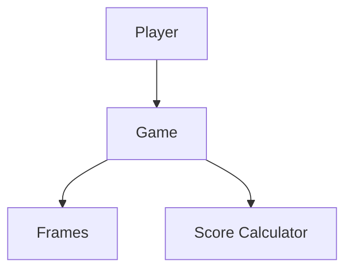
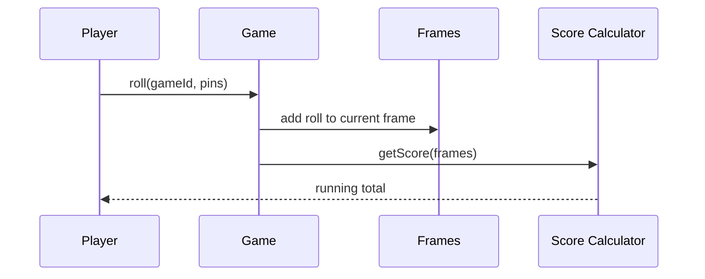

# High-Level Design: Bowling Alley / Scoring System

## 1. Overview

A **bowling game** has **10 frames**; each frame **1 or 2 rolls** (except frame 10 which can have 3); **scoring** with **strike** (10 in one roll) and **spare** (10 in two rolls); **bonus** pins from following rolls. Manages **lanes**, **games**, and **score calculation**.

---

## System Design Process
- **Step 1: Clarify Requirements** — See §2 below (frames, scoring, lanes).
- **Step 2: High-Level Design** — Game, frames, score calculator; see §3 below.
- **Step 3: Detailed Design** — Strike/spare logic; API: roll(pins), getScore(). See LLD.
- **Step 4: Scale & Optimize** — Multiple lanes; single-game.

#### High-Level Architecture

**Mermaid:**



#### Flow Diagram — Roll and get score

**Mermaid:**



**API endpoints:** createGame(), roll(gameId, pins), getScore(gameId). See LLD.

---

## 2. Requirements

- **Lane:** Multiple lanes; each lane can have an active game.
- **Game:** One or two players; 10 frames; each frame: roll(pins) once or twice (or three times in frame 10 if strike/spare).
- **Scoring:** Strike (10 in first roll of frame): frame score = 10 + next two rolls. Spare (10 in two rolls of frame): frame score = 10 + next one roll. Open: frame score = sum of rolls in frame. Running total = cumulative sum of frame scores.
- **State:** Current frame, current roll in frame; game over after frame 10 and all bonus rolls applied.
- **Optional:** Multiple games per lane (queue); player names; history.

---

## 3. High-Level Architecture

```
┌─────────────┐     Roll(pins)    ┌──────────────────┐
│  Player     │───────────────────►│  Game            │
│             │                    │  Controller      │
└─────────────┘                    └────────┬─────────┘
                                             │
                    ┌────────────────────────┼────────────────────────┐
                    │                        │                        │
                    ▼                        ▼                        ▼
           ┌────────────────┐      ┌────────────────┐      ┌────────────────┐
           │  Frames & Rolls│      │  Score         │      │  Lane          │
           │  (per frame:   │      │  Calculator    │      │  (active game, │
           │   rolls[])     │      │  (strike/spare │      │   queue)        │
           │                │      │   logic)       │      │                │
           └────────────────┘      └────────────────┘      └────────────────┘
```

---

## 4. Core Components

| Component | Responsibility |
|-----------|----------------|
| **Game** | currentPlayerIndex, frames[10] (each frame: rolls list); roll(pins) — validate (0–10, frame not complete); append to current frame; if strike (frame 1–9) or spare or two rolls in frame, advance; in frame 10 handle third roll if strike/spare. |
| **ScoreCalculator** | getFrameScore(frames, frameIndex) — if strike: 10 + next two rolls (may be in next frame); if spare: 10 + next one roll; else sum of rolls in frame. getTotalScore(frames) — sum getFrameScore for i 0..9. |
| **Frame** | rolls: List<Integer>; isStrike() = rolls[0]==10; isSpare() = rolls.size()>=2 && rolls[0]+rolls[1]==10; isComplete() depends on frame number and strike/spare. |
| **Lane** | laneId; currentGame; optional queue of waiting games; startGame(players); endGame(). |

---

## 5. Scoring Rules (HLD)

- **Strike (frame 1–9):** Score for that frame = 10 + next two rolls (could be in next frame or frame 10).
- **Spare (frame 1–9):** Score = 10 + next one roll.
- **Frame 10:** If strike: two bonus rolls; if spare: one bonus roll; else two rolls only. Sum all rolls in frame 10 plus bonuses for frame 10 score.
- **Total:** Sum of frame scores for frames 1–10.

---

## 6. Data Flow

1. **Roll:** Player rolls; roll(pins) added to current frame. Validate: pins 0–10; in frame 10, validate second/third roll (e.g. second roll after strike max 10 unless first was 10 then second can be 10 and third 0–10). Recalculate running score (all frames that are now complete).
2. **Turn:** After roll, if frame complete for current player, switch to next player (or same player if single player). If all players completed frame 10 and no bonus pending, game over.
3. **Score display:** After each roll, show per-frame score and running total for each player.

---

## 7. Design Patterns (HLD View)

- **State:** Game state (current frame, current player, roll index in frame); frame completion and frame 10 bonus state.
- **Strategy:** Score calculation encapsulated (strike/spare/open); same interface for each frame.
- **Template:** getFrameScore(i) uses same pattern: if strike then 10+next2, else if spare then 10+next1, else sum(rolls).

---

## 8. Trade-offs

| Decision | Choice | Rationale |
|----------|--------|-----------|
| Frame 10 storage | Store up to 3 rolls | Correct for strike (2 bonus) or spare (1 bonus) |
| Score timing | Compute after each roll for completed frames | Frame score fixed when bonus rolls known |
| Validation | Pins 0–10; two-roll sum ≤10 (except strike) | Standard rules; frame 10 has special cases |

---

## Interview-Readiness Enhancements

### Capacity & SLO framing
- Define read/write QPS separately and estimate peak vs average traffic.
- Add latency budgets (p95/p99) per critical hop and target availability.
- State durability target and expected data growth/day.

### Critical path clarity
- Document write path (authoritative commit first, async side-effects second).
- Document read path (cache/read model first, fallback to source of truth).
- Identify likely hotspots (hot keys, hot partitions, fanout spikes).

### Failure handling
- Define retry strategy (bounded retries, backoff, jitter).
- Add circuit breakers and bulkheads for unstable dependencies.
- Cover queue failures (DLQ, replay) and datastore failover behavior.

### Security, operations, and cost
- Baseline security: AuthN/AuthZ, encryption in transit/at rest, secrets rotation.
- Observability: golden signals, SLO alerts, tracing, runbooks, canary/rollback.
- DR/cost: explicit RTO/RPO and top cost drivers with optimization levers.

### Trade-off table (mandatory)
- Include at least two realistic alternatives with decision rationale for this system.

