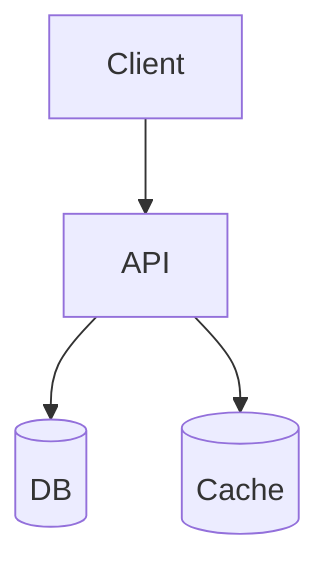
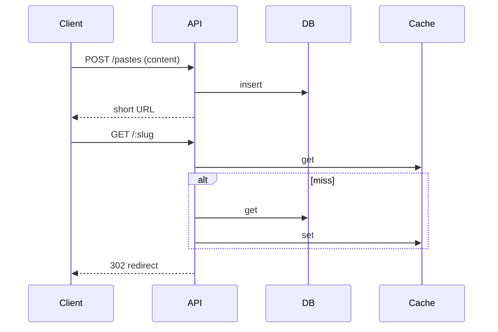

# HLD: Pastebin (Code / Text Paste with Expiry)

## 1. Overview

Users create **pastes** (text/code); get a **short URL**; optional **expiry** (10m, 1h, 1d, never) and **access** (public/unlisted/private). High read volume; simple write.

---

## System Design Process
- **Step 1: Clarify Requirements** — See §2 below (create paste, short URL, expiry, access).
- **Step 2: High-Level Design** — Write path, read path (cache + DB); see §3 below.
- **Step 3: Detailed Design** — DB for pastes; cache for hot pastes; see LLD for full API list.
- **Step 4: Scale & Optimize** — Cache-first read; shard by slug; see Scaling below.

#### High-Level Architecture

**Mermaid:**



#### Flow Diagram — Create paste and redirect

**Mermaid:**



**API endpoints (required):** POST `/v1/pastes`, GET `/:slug`. See LLD for full list.

---

## 2. Requirements

- Create paste: content, expiry, optional custom slug, optional password.
- Redirect short URL → raw content or styled page; optional syntax highlighting.
- Expiry: TTL; delete or 404 after expiry.
- Optional: unlisted (no listing); private (password or token); view count.

---

## 3. Architecture (Concise)

- **Write:** Validate content size; generate slug (random or custom); store (slug, content, expiry, created_at) in DB; optional cache set.
- **Read:** GET /:slug → lookup cache/DB; if expired, 404; else return content (or HTML page); increment view count (async).
- **Storage:** DB (slug PK, content TEXT, expiry, views); object store for large content with DB reference. Cache: slug → content (TTL = min(expiry, 1h)).
- **Slug:** Short random (e.g. 8 chars) or custom; unique check on create.
- **Scale:** Read-heavy; cache at LB or Redis; DB read replicas.

---

## 4. Data Model

```text
pastes: slug PK, content TEXT, expiry_at, created_at, views, password_hash?
```

---

## 5. Trade-offs

| Decision | Choice |
|----------|--------|
| Content size | Limit (e.g. 1 MB); large = object store + ref in DB |
| Expiry | TTL in DB; background job or lazy delete on read |
| Slug | Random (collision retry) or base62 counter |
| Cache | Cache content by slug; TTL = remaining expiry |

---

## Interview-Readiness Enhancements

### Capacity & SLO framing
- Define read/write QPS separately and estimate peak vs average traffic.
- Add latency budgets (p95/p99) per critical hop and target availability.
- State durability target and expected data growth/day.

### Critical path clarity
- Document write path (authoritative commit first, async side-effects second).
- Document read path (cache/read model first, fallback to source of truth).
- Identify likely hotspots (hot keys, hot partitions, fanout spikes).

### Failure handling
- Define retry strategy (bounded retries, backoff, jitter).
- Add circuit breakers and bulkheads for unstable dependencies.
- Cover queue failures (DLQ, replay) and datastore failover behavior.

### Security, operations, and cost
- Baseline security: AuthN/AuthZ, encryption in transit/at rest, secrets rotation.
- Observability: golden signals, SLO alerts, tracing, runbooks, canary/rollback.
- DR/cost: explicit RTO/RPO and top cost drivers with optimization levers.

### Trade-off table (mandatory)
- Include at least two realistic alternatives with decision rationale for this system.

