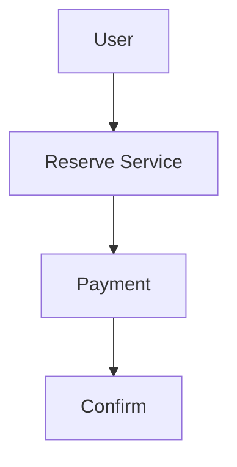
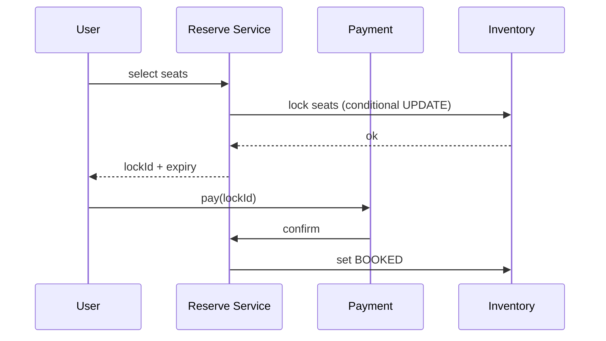

# HLD: Ticketmaster (Event Ticketing)

## 1. Overview

**Events** (concerts, sports) at **venues**; **seats** (or general admission); **sale** at a time; users **reserve** seats (lock) then **pay**; high concurrency for popular events.

---

## System Design Process
- **Step 1: Clarify Requirements** — See §2 below (events, reserve, pay, no double-sell).
- **Step 2: High-Level Design** — Event, reservation, payment services; see §3 below.
- **Step 3: Detailed Design** — Seat inventory, lock; see LLD for full API list.
- **Step 4: Scale & Optimize** — Conditional updates, queue: see Scaling below.

#### High-Level Architecture

**Mermaid:**



#### Flow Diagram — Reserve and confirm booking

**Mermaid:**



**API endpoints (required):** GET `/v1/events/:id`, POST `/v1/events/:id/reserve`, POST `/v1/reservations/:id/pay`. See LLD for full list.

---

## 2. Requirements

- Events: venue, date, seat map or capacity; **on-sale time**.
- **Reserve:** User selects seats (or quantity for GA); lock for N minutes; must pay before expiry.
- **Pay:** Confirm reservation; issue ticket; send confirmation.
- **Concurrency:** No double-sell; same approach as BookMyShow (lock then confirm; conditional update on seat status).
- **Optional:** Queue when sale opens; waitlist; transfer/cancel.

---

## 3. Architecture

- **Seat map:** Venue has sections/rows/seats; each seat: event_id, seat_id, status (AVAILABLE/LOCKED/SOLD).
- **Reserve:** Lock seats (UPDATE status=LOCKED, locked_by, expires_at WHERE status=AVAILABLE); return hold_id.
- **Confirm:** On payment success; UPDATE status=SOLD; create Ticket; release hold.
- **Timeout:** Cron releases LOCKED where expires_at < now().
- **Scale:** Partition by event_id; use DB transactions or optimistic locking; optional queue (e.g. Kafka) to serialize reserve requests per event.

---

## 4. Data Model

```text
events, venues, seats (event_id, seat_id, status, locked_by?, expires_at?), holds, tickets
```

---

## 5. Concurrency (Same as BookMyShow)

- Conditional UPDATE: WHERE status=AVAILABLE AND seat_id IN (...); check affected rows = number of seats; else retry or fail.
- Pessimistic: SELECT FOR UPDATE on seats row; then update; commit.
