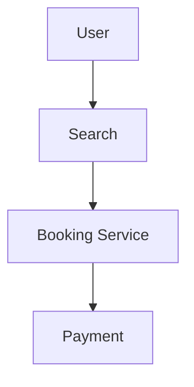
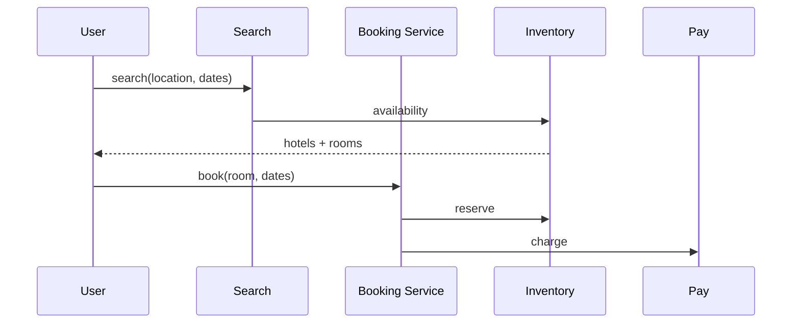

# HLD: Hotel Booking System

## 1. Overview

**Hotels**, **rooms** (type, capacity, price); **inventory** per date (available/blocked); **booking:** check-in/out dates, room type, guest; **search** by location/dates; **reserve** then **confirm** (pay).

---

## System Design Process
- **Step 1: Clarify Requirements** — See §2 below (search, availability, book, cancel).
- **Step 2: High-Level Design** — Search, inventory, booking services; see §3 below.
- **Step 3: Detailed Design** — Inventory and booking DB; see LLD for full API list.
- **Step 4: Scale & Optimize** — Sharding, caching: see Scaling below.

#### High-Level Architecture

**Mermaid:**



#### Flow Diagram — Search and book

**Mermaid:**



**API endpoints (required):** GET `/v1/hotels/search`, GET `/v1/rooms/availability`, POST `/v1/bookings`, POST `/v1/bookings/:id/confirm`. See LLD for full list.

---

## 2. Requirements

- Search: city/location, check-in, check-out, guests → list hotels with available rooms and price.
- **Availability:** Room type available if for each night in [check-in, check-out) there is inventory (not fully booked).
- **Book:** Select room type; reserve (lock inventory for those dates); pay; confirm booking; send confirmation.
- **Cancel:** Policy-based (refund, credit); release inventory.
- **Optional:** Multiple rooms per booking; room assignment at check-in; ratings.

---

## 3. Architecture

- **Inventory:** room_type_id, date, total_rooms, booked_count (or available); or slots (room_id, date) with status.
- **Search:** For date range [cin, cout), for each hotel/room_type: min over dates of (total - booked) >= rooms_needed; price = sum of nightly rate.
- **Reserve:** For each date in range: UPDATE inventory SET booked_count = booked_count + ? WHERE ... AND (total - booked_count) >= ?; if any fail, rollback. Create booking (PENDING); return booking_id.
- **Confirm:** On payment; set booking CONFIRMED; optional: assign room_ids. **Cancel:** Decrement booked_count for dates; set booking CANCELLED.
- **Scale:** Shard by hotel_id or date; cache availability for hot dates.

---

## 4. Data Model

```text
hotels, room_types (hotel_id, type, base_price), inventory (room_type_id, date, total, booked), bookings (id, hotel_id, room_type_id, check_in, check_out, guest_id, status)
```

---

## Interview-Readiness Enhancements

### Capacity & SLO framing
- Define read/write QPS separately and estimate peak vs average traffic.
- Add latency budgets (p95/p99) per critical hop and target availability.
- State durability target and expected data growth/day.

### Critical path clarity
- Document write path (authoritative commit first, async side-effects second).
- Document read path (cache/read model first, fallback to source of truth).
- Identify likely hotspots (hot keys, hot partitions, fanout spikes).

### Failure handling
- Define retry strategy (bounded retries, backoff, jitter).
- Add circuit breakers and bulkheads for unstable dependencies.
- Cover queue failures (DLQ, replay) and datastore failover behavior.

### Security, operations, and cost
- Baseline security: AuthN/AuthZ, encryption in transit/at rest, secrets rotation.
- Observability: golden signals, SLO alerts, tracing, runbooks, canary/rollback.
- DR/cost: explicit RTO/RPO and top cost drivers with optimization levers.

### Trade-off table (mandatory)
- Include at least two realistic alternatives with decision rationale for this system.

