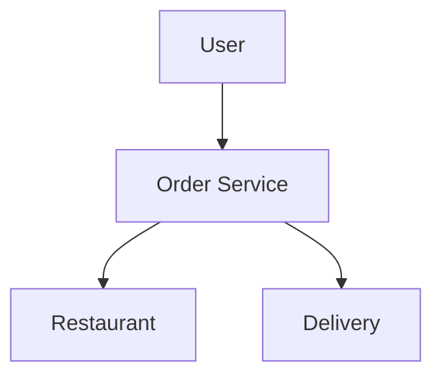
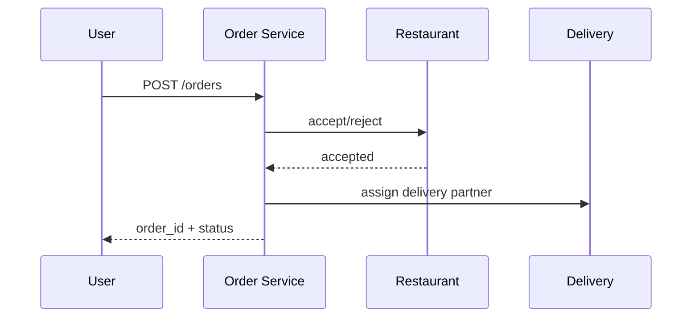

# HLD: Food Delivery (Swiggy/Zomato-style)

## 1. Overview

**Restaurants** with **menu**; **users** place **orders** (cart → checkout); **delivery** (assign delivery partner, track); **payments**; **notifications**.

---

## System Design Process
- **Step 1: Clarify Requirements** — See §2 below (browse, order, track, pay).
- **Step 2: High-Level Design** — Order, restaurant, delivery, payment services; see §3 below.
- **Step 3: Detailed Design** — Order and inventory DB; see LLD for full API list.
- **Step 4: Scale & Optimize** — Sharding, queues: see Scaling below.

#### High-Level Architecture

**Mermaid:**

#### Flow Diagram — Place order and assign delivery

**Mermaid:**

**API endpoints (required):** GET `/v1/restaurants`, POST `/v1/orders`, GET `/v1/orders/:id`, POST `/v1/orders/:id/accept`. See LLD for full list.

---

## 2. Requirements

- Browse restaurants (by location, cuisine); menu with price; add to cart.
- **Order:** Address, payment; create order (PENDING); restaurant **accepts/rejects**; **preparation**; assign **delivery partner**; **dispatch** → **delivered**.
- **Tracking:** Order status; ETA; live location of delivery partner (optional).
- **Payments:** Online (gateway) or COD; refund on cancel.
- **Notifications:** Order placed, accepted, out for delivery, delivered; push/ SMS.

---

## 3. Architecture

- **Order flow:** User checkout → OrderService creates order (PENDING) → notify restaurant; Restaurant accepts → status ACCEPTED; kitchen prepares → READY; DispatchService assigns partner → ASSIGNED; partner picks up → OUT_FOR_DELIVERY; partner marks delivered → DELIVERED. Cancel possible in PENDING/ACCEPTED with policy.
- **Assignment:** Near restaurant + available partners; score by distance, rating; assign one; notify partner.
- **Inventory:** Menu item availability (optional); restaurant can mark items unavailable.
- **Scale:** Orders shard by order_id or user_id; restaurant and partner services separate; message queue for events (order created, status change) → notification and tracking updates.
- **Data:** users, restaurants, menu_items, orders, order_items, delivery_partners, assignments, payments.

---

## 4. Key Components

| Component | Responsibility |
|-----------|----------------|
| OrderService | Create order; state machine (PENDING→ACCEPTED→PREPARING→READY→ASSIGNED→OUT_FOR_DELIVERY→DELIVERED); cancel |
| RestaurantService | Accept/reject; update prep status; menu CRUD |
| DispatchService | Assign partner (geo, availability); notify partner; track |
| PaymentService | Charge; refund on cancel |
| NotificationService | Push/SMS on status change (subscribe to order events) |

---

## 5. Trade-offs

- **Idempotency:** Create order with idempotency key to avoid double order on retry.
- **Partner assignment:** Pull (partner polls) vs push (server assigns and pushes to app); push better for latency.
- **Tracking:** Partner app sends location periodically; store in cache/DB; API returns last position and ETA.
