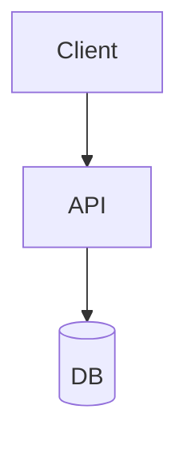
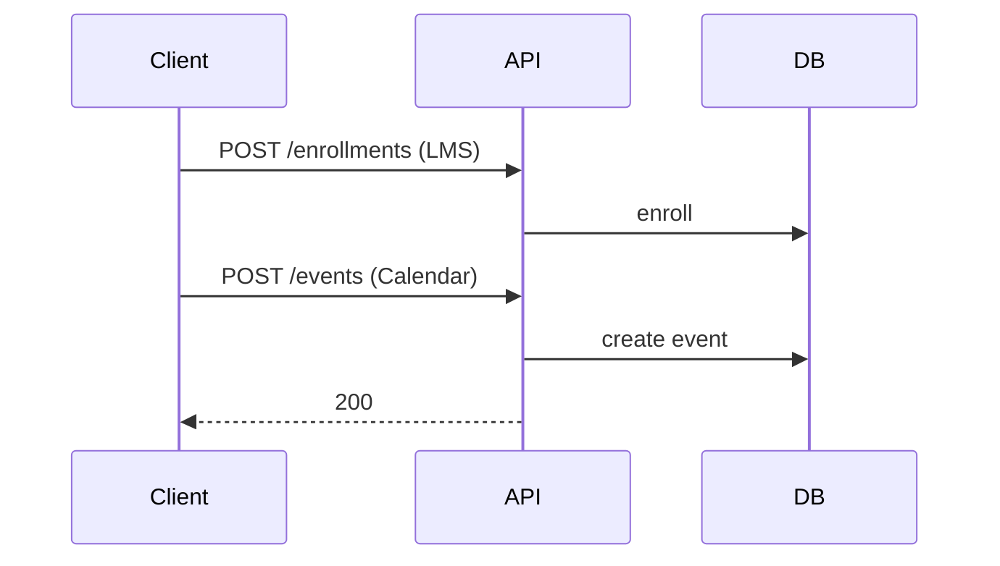

# HLD: Learning Management System (LMS) & Calendar

## System Design Process
- **Step 1: Clarify Requirements** — LMS: courses, enrollments, progress; Calendar: events, free/busy. See below.
- **Step 2: High-Level Design** — LMS: course, enrollment, progress services; Calendar: event store, conflict check.
- **Step 3: Detailed Design** — DB for courses, events; see LLD for full API list.
- **Step 4: Scale & Optimize** — Sharding by org/user; CDN for video.

#### High-Level Architecture

**Mermaid:**

#### Flow Diagram — LMS enroll and Calendar create event

**Mermaid:**

**API endpoints (required):** LMS: GET/POST `/v1/courses`, POST `/v1/enrollments`, GET `/v1/progress`. Calendar: GET/POST `/v1/events`, GET `/v1/freebusy`. See LLD for full list.

---

## Learning Management System (LMS)

- **Courses** (modules, lessons); **enrollments**; **progress** (completed lessons); **assignments** and **grades**; **discussions**; **certificates**.
- **Instructors** create content; **students** consume; **admin** manages users and courses.
- **Scale:** Catalog DB; progress and video streams (if any) like video platform; assignments and submissions stored; optional CDN for video.

## Calendar Application

- **Events** (title, start, end, recurrence, calendar_id); **calendars** (user, shared); **invites** (attendees, accept/decline); **free/busy** for scheduling.
- **Sync:** Multi-device; conflict resolution (last-write-wins or merge); optional CalDAV.
- **Design:** Same as Meeting Scheduler (see 55) at scale: events table (user_id, calendar_id, start, end, recurrence_rule); get conflicts; suggest slots; share/visibility.

## One-Liner Mapping

- **LMS:** CourseService, LessonService, EnrollmentService, ProgressService, AssignmentService; DB: courses, lessons, enrollments, progress, assignments, submissions.
- **Calendar:** EventService, CalendarService; events (id, calendar_id, start, end, title, recurrence); getEvents(calendarId, range); create/update/delete; share calendar = permission; invite = event.attendees + response.

---

## Interview-Readiness Enhancements

### Capacity & SLO framing
- Define read/write QPS separately and estimate peak vs average traffic.
- Add latency budgets (p95/p99) per critical hop and target availability.
- State durability target and expected data growth/day.

### Critical path clarity
- Document write path (authoritative commit first, async side-effects second).
- Document read path (cache/read model first, fallback to source of truth).
- Identify likely hotspots (hot keys, hot partitions, fanout spikes).

### Failure handling
- Define retry strategy (bounded retries, backoff, jitter).
- Add circuit breakers and bulkheads for unstable dependencies.
- Cover queue failures (DLQ, replay) and datastore failover behavior.

### Security, operations, and cost
- Baseline security: AuthN/AuthZ, encryption in transit/at rest, secrets rotation.
- Observability: golden signals, SLO alerts, tracing, runbooks, canary/rollback.
- DR/cost: explicit RTO/RPO and top cost drivers with optimization levers.

### Trade-off table (mandatory)
- Include at least two realistic alternatives with decision rationale for this system.

