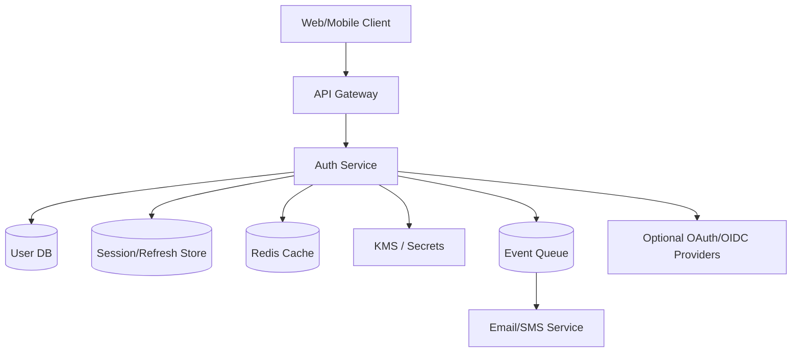
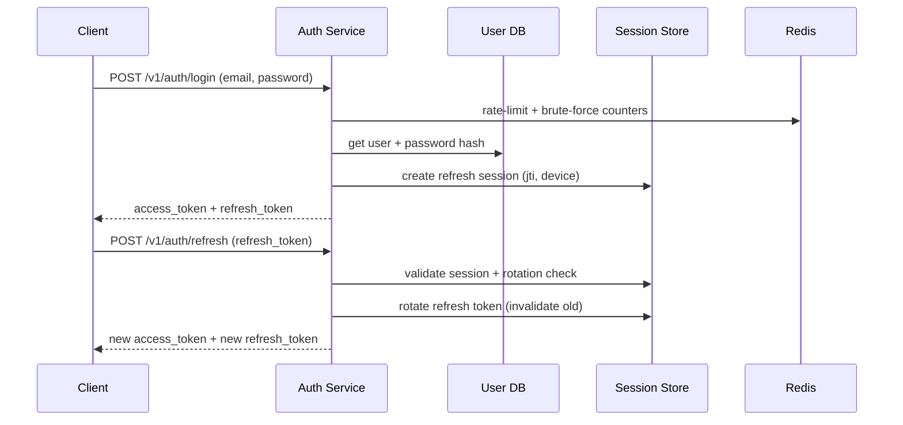

# HLD: User Authentication System

## 1. Overview

A centralized **Auth platform** that supports signup, login, logout, token refresh, password reset, and optional MFA. It issues short-lived **access tokens** and revocable **refresh tokens** for web/mobile clients and internal services.

---

## System Design Process
- **Step 1: Clarify Requirements** — See §2 (signup/login/reset/MFA, security and SLOs).
- **Step 2: High-Level Design** — Auth API, identity store, token service, risk controls; see §3.
- **Step 3: Detailed Design** — User/session/token schema and API contracts; see LLD.
- **Step 4: Scale & Optimize** — Stateless access tokens, cache-backed session checks, queue-based notifications.

#### High-Level Architecture



#### Flow Diagram — Login + Refresh



**API endpoints (required):** signup/login/refresh/logout/forgot-password/reset-password. See LLD for full list.

---

## 2. Requirements

### Functional
- User signup with email/phone verification.
- Login with email/username + password.
- Access token issuance (JWT/PASETO) and refresh token rotation.
- Logout from current device and optional logout-all-devices.
- Forgot password + reset using time-bound one-time token.
- Optional MFA (TOTP/OTP/push) and device trust.
- Audit events: login success/failure, suspicious attempts.

### Non-Functional
- High availability (target 99.95%+).
- Low latency: login p95 < 300 ms; token verify p95 < 30 ms (with local signature verification).
- Strong security posture (hashing, encryption, secret rotation, abuse prevention).
- Consistency: strong for credential updates/session revocation; eventual acceptable for analytics.

### Constraints / Assumptions
- Passwords are never stored in plaintext (Argon2id/bcrypt with per-user salt).
- Access tokens short TTL (e.g., 15 min); refresh tokens longer TTL (e.g., 30 days).
- Zero-trust between services: every call carries verifiable identity.

---

## 3. Architecture (Concise)

- **API Gateway:** TLS termination, IP throttling, WAF, bot filtering.
- **Auth Service:** handles signup/login/reset/MFA/token lifecycle.
- **User Store (SQL):** authoritative user profile and credential metadata.
- **Session Store (SQL/NoSQL):** refresh token sessions keyed by user + device + jti.
- **Cache (Redis):** rate-limit counters, revoked-jti bloom/set, OTP throttles.
- **Notification Service:** email/SMS for verify/reset via async queue.
- **KMS/HSM:** signing key management, envelope encryption.

### Write Path (Signup)
1. Validate input + anti-automation checks.
2. Create user row with pending_verification.
3. Generate verification token and publish email/SMS task.
4. On verify endpoint: mark email_verified=true, emit audit event.

### Write Path (Login)
1. Apply per-IP and per-account rate limits.
2. Verify password hash and account status.
3. Optional risk checks (new geo/device) and MFA challenge.
4. Create session record and issue tokens.
5. Emit login event for audit and anomaly models.

### Read Path (Token Verification)
1. Downstream service verifies token signature locally using public key / JWKS cache.
2. Check critical claims: exp, nbf, aud, iss, sub.
3. Optional revocation check by jti in cache/session store for sensitive actions.

---

## 4. Data Model

```text
users: user_id PK, email UNIQUE, phone UNIQUE, password_hash, password_algo,
       email_verified, phone_verified, mfa_enabled, status, created_at, updated_at

auth_sessions: session_id PK, user_id FK, refresh_jti UNIQUE, device_id, ip, user_agent,
               created_at, expires_at, revoked_at, rotated_from_jti

password_resets: token_hash PK, user_id FK, expires_at, used_at, created_at

audit_auth_events: event_id PK, user_id, type, ip, user_agent, metadata_json, created_at
```

---

## 5. Security and Reliability

- **Password security:** Argon2id, pepper in KMS, adaptive rehash policy.
- **Token security:** asymmetric signing (RS256/EdDSA), key rotation with overlapping kids.
- **Replay protection:** refresh token rotation + one-time use detection.
- **Abuse controls:** CAPTCHA on suspicious traffic, account lock/backoff, geo-velocity checks.
- **Transport/Data security:** TLS everywhere; PII encryption at rest.
- **Reliability:** retries with jitter for notification provider; DLQ for failed messages; circuit breaker around third-party IdP.

---

## 6. Trade-offs

| Decision | Choice | Alternative | Why this choice |
|----------|--------|-------------|-----------------|
| Access token format | Self-contained JWT | Opaque token + introspection | Lower latency and fewer auth round trips |
| Revocation strategy | Short TTL + jti blocklist for critical endpoints | Full introspection for every API | Balances security and scale |
| Session storage | Stateful refresh tokens in DB | Stateless long-lived tokens | Enables logout/device revoke and theft containment |
| Password login | Native credentials + optional social login | Passwordless-only | Better compatibility for v1; can add passkeys later |

---

## Interview-Readiness Enhancements

### Capacity & SLO framing
- Estimate active users, login burst QPS, token verify QPS.
- Budget latency per hop (gateway, hash verify, DB, token sign).
- Define error budgets and auth-specific SLO dashboards.

### Failure handling
- Graceful degradation when email provider is down (queue + retry).
- Key compromise runbook (key revoke, forced re-auth, token invalidation).
- Region failover with replicated session store and clear RTO/RPO.

### Security, operations, and cost
- Mandatory audit trail for privileged auth changes.
- Canary rollout for auth logic/schema migrations.
- Cost levers: cache hit ratio, hash-cost tuning, token TTL optimization.
